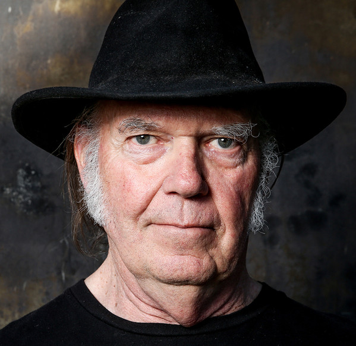

# Neil Young

## Artist Profile

Neil Young is a Canadian-American singer-songwriter and a musician who plays guitar, keyboards and harmonica. He also runs Vapor Records and is active on environmental and political issues. Young is famous for his solo releases, his releases with Crazy Horse and for being a member of Crosby, Stills, Nash &amp; Young (aka CSNY). Born November 12, 1945 in Toronto, Ontario, Canada, he currently holds dual citizenship for Canada and the United States and has been living in California since the sixties. He was inducted into the Rock And Roll Hall of Fame in 1995 (Performer category). Young had announced in 2019 that his application for United States citizenship had been held up because of his use of marijuana, but the issue was resolved and he did become a United States citizen.

## Artist Links

- [https://neilyoungarchives.com/](https://neilyoungarchives.com/)
- [https://hyperrust.org/](https://hyperrust.org/)
- [http://thrasherswheat.org/](http://thrasherswheat.org/)
- [https://en.wikipedia.org/wiki/Neil_Young](https://en.wikipedia.org/wiki/Neil_Young)
- [https://www.facebook.com/NeilYoungRepriseRecords/](https://www.facebook.com/NeilYoungRepriseRecords/)
- [https://www.last.fm/music/Neil+Young](https://www.last.fm/music/Neil+Young)
- [https://twitter.com/Neilyoung](https://twitter.com/Neilyoung)
- [https://www.youtube.com/channel/UC6JhadLTf6g6f-ZdeEaAqBQ](https://www.youtube.com/channel/UC6JhadLTf6g6f-ZdeEaAqBQ)

## See also

- [Harvest](Harvest.md)
- [Zuma](Zuma.md)
