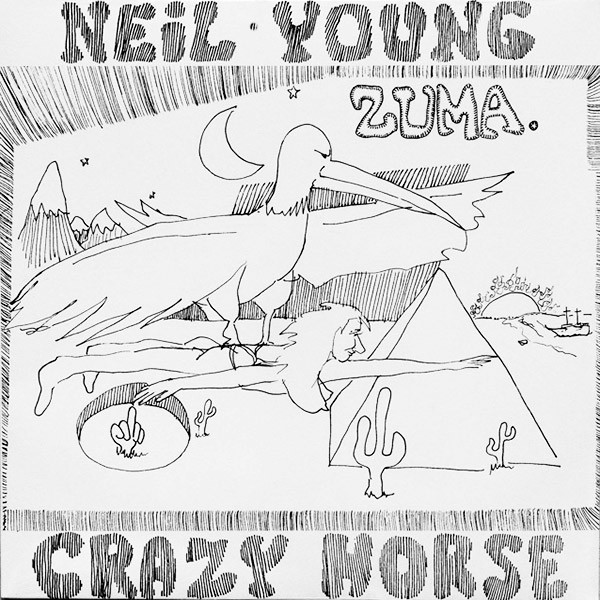

# Zuma

By Neil Young

## Album Data

[Discogs URL](https://www.discogs.com/release/9023229-Neil-Young-With-Crazy-Horse-Zuma)

- Label: Reprise Records
- Formats: Vinyl, LP, Album, Reissue, Remastered
- Genres: Rock, Classic Rock
- Rating: 4.62
- Released: 2015
- Year: 1975
- Release ID: 9023229
- Media condition: 
- Sleeve condition: 
- Speed: 
- Weight: 
- Notes: 

## Album Tracks

| **Position** | **Title** | **Duration** |
|--------------|-----------|--------------|
| A1 | **Don't Cry No Tears** | 2:34 |
| A2 | **Danger Bird** | 6:54 |
| A3 | **Pardon My Heart** | 3:49 |
| A4 | **Lookin' For A Love** | 3:17 |
| A5 | **Barstool Blues** | 3:02 |
| B1 | **Stupid Girl** | 3:13 |
| B2 | **Drive Back** | 3:32 |
| B3 | **Cortez The Killer** | 7:29 |
| B4 | **Through My Sails** | 2:41 |

## Artist Roles

| **Name** | **Role** |
|----------|----------|
| **Billy Talbot** | Backing Vocals |
| **Ralph Molina** | Backing Vocals |
| **Billy Talbot** | Bass |
| **James Mazzeo** | Cover |
| **Ralph Molina** | Drums |
| **Bernie Grundman** | Lacquer Cut By |
| **Chris Bellman** | Lacquer Cut By |
| **Elliot Roberts** | Management [Directed By] |
| **David Briggs** | Producer |
| **Neil Young** | Producer |
| **Tim Mulligan** | Producer |
| **Chris Bellman** | Remastered By [Remastered For Vinyl] |
| **Frank Sampedro** | Rhythm Guitar |
| **Neil Young** | Vocals, Written-By |

