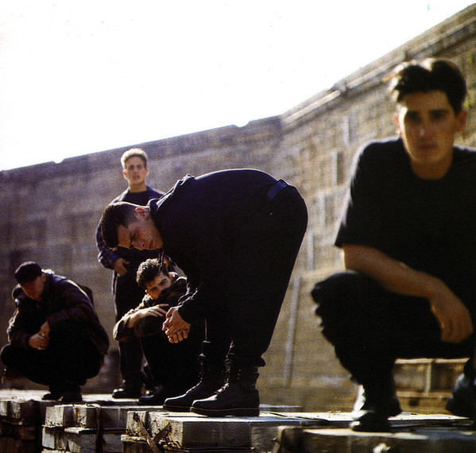

# New Kids On The Block

## Artist Profile

American boy band from Boston, Massachusetts established in 1984. One half of the boy band supergroup NKOTBSB.. The band consists of brothers Jonathan and Jordan Knight, Joey McIntyre, Donnie Wahlberg, and Danny Wood. New Kids on the Block enjoyed success in the late 1980s and early 1990s and have sold more than 70 million records worldwide. Their hits include "(You Got It (The Right Stuff)", "Step By Step", "Hangin' Tough" and "Please Don't Go Girl". They won two American Music Awards in 1990 for Favorite Pop/Rock Band, Duo, or Group and Favorite Pop/Rock Album. The group disbanded in 1994, and publicly reunited in 2008.

## Artist Links

- [http://nkotb.com/](http://nkotb.com/)
- [https://www.facebook.com/nkotb/](https://www.facebook.com/nkotb/)
- [https://twitter.com/NKOTB](https://twitter.com/NKOTB)
- [https://www.instagram.com/nkotb/](https://www.instagram.com/nkotb/)
- [https://myspace.com/newkidsontheblock](https://myspace.com/newkidsontheblock)
- [https://en.wikipedia.org/wiki/New_Kids_on_the_Block](https://en.wikipedia.org/wiki/New_Kids_on_the_Block)
- [https://www.youtube.com/user/nkotbdotcom](https://www.youtube.com/user/nkotbdotcom)
- [https://www.youtube.com/user/NewKidsVEVO](https://www.youtube.com/user/NewKidsVEVO)

## See also

- [Step By Step](Step_By_Step.md)
