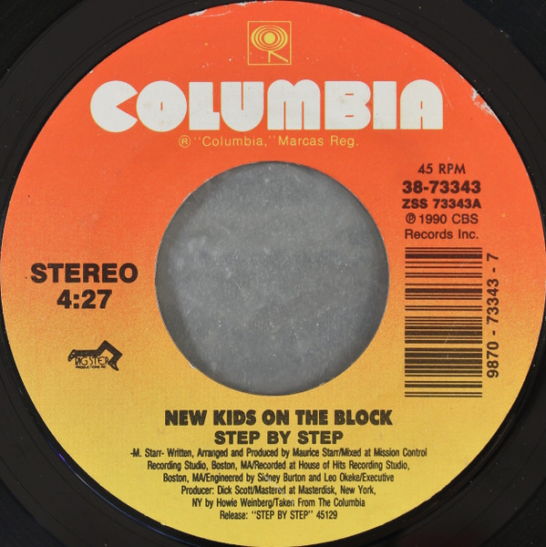

# Step By Step

By New Kids On The Block

## Album Data

[Discogs URL](https://www.discogs.com/release/2775885-New-Kids-On-The-Block-Step-By-Step)

- Label: Columbia
- Formats: Vinyl, 7", 45 RPM, Single, Styrene, Stereo
- Genres: Electronic, Pop, Synth-pop
- Rating: 3.29
- Released: 1990
- Year: 1990
- Release ID: 2775885
- Media condition: 
- Sleeve condition: 
- Speed: 
- Weight: 
- Notes: 

## Album Tracks

| **Position** | **Title** | **Duration** |
|--------------|-----------|--------------|
| A | **Step By Step** | 4:27 |
| B | **Valentine Girl** | 3:57 |

## Artist Roles

| **Name** | **Role** |
|----------|----------|
| **Maurice Starr** | Arranged By, Producer, Written-By |
| **Leo Okeke** | Engineer |
| **Sidney Burton** | Engineer |
| **Dick Scott (3)** | Executive-Producer |
| **Howie Weinberg** | Mastered By |
| **Maurice Starr** | Written-By |

