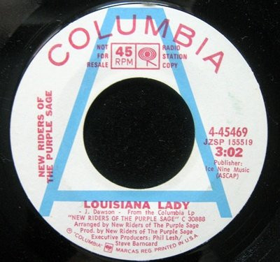

# Louisiana Lady

By New Riders Of The Purple Sage

## Album Data

[Discogs URL](https://www.discogs.com/release/3389218-New-Riders-Of-The-Purple-Sage-Louisiana-Lady)

- Label: Columbia
- Formats: Vinyl, 7", Single, 45 RPM, Promo
- Genres: Rock, Classic Rock, Country Rock
- Rating: 5
- Released: 1971
- Year: 1971
- Release ID: 3389218
- Media condition: 
- Sleeve condition: 
- Speed: 
- Weight: 
- Notes: 

## Album Tracks

| **Position** | **Title** | **Duration** |
|--------------|-----------|--------------|
| A | **Louisiana Lady** | 3:02 |
| B | **Last Lonely Eagle** | 5:14 |

## Artist Roles

| **Name** | **Role** |
|----------|----------|
| **Phil Lesh** | Executive Producer |
| **Steve Barncard** | Executive Producer |
| **New Riders Of The Purple Sage** | Producer, Arranged By |
| **John Dawson** | Written-By |

