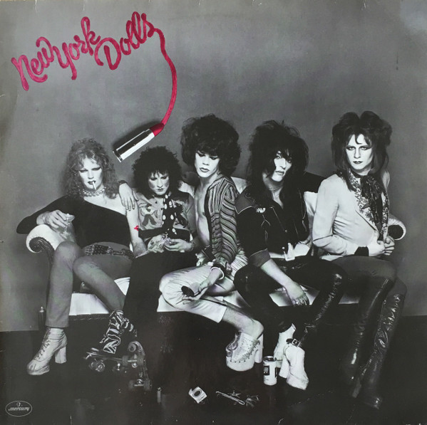

# New York Dolls

By New York Dolls

## Album Data

[Discogs URL](https://www.discogs.com/release/1801495-New-York-Dolls-New-York-Dolls)

- Label: Mercury
- Formats: Vinyl, LP, Album, Reissue
- Genres: Rock, Glam
- Rating: 4.41
- Released: null
- Year: 1973
- Release ID: 1801495
- Media condition: 
- Sleeve condition: 
- Speed: 
- Weight: 
- Notes: 

## Album Tracks

| **Position** | **Title** | **Duration** |
|--------------|-----------|--------------|
| A1 | **Personality Crisis** | 3:41 |
| A2 | **Looking For A Kiss** | 3:19 |
| A3 | **Vietnamese Baby** | 3:38 |
| A4 | **Lonely Planet Boy** | 4:09 |
| A5 | **Frankenstein  (Orig.)** | 6:00 |
| B1 | **Trash** | 3:08 |
| B2 | **Bad Girl** | 3:04 |
| B3 | **Subway Train** | 4:21 |
| B4 | **Pills** | 2:48 |
| B5 | **Private World** | 3:39 |
| B6 | **Jet Boy** | 4:41 |

## Artist Roles

| **Name** | **Role** |
|----------|----------|
| **New York Dolls** | Arranged By |
| **Arthur Kane** | Bass |
| **Jerry Nolan** | Drums |
| **Ed Sprigg** | Engineer |
| **Jack Douglas** | Engineer |
| **David Krebs** | Executive-Producer |
| **Marty Thau** | Executive-Producer |
| **Paul Nelson** | Executive-Producer |
| **Steve Leber** | Executive-Producer |
| **Johnny Thunders** | Guitar, Vocals |
| **Sylvain Sylvain** | Guitar, Vocals, Piano |
| **Todd Rundgren** | Producer, Piano [Additional], Synthesizer [Moog] |
| **The Fantastic Buddy Bowser** | Saxophone |
| **David Johansen** | Vocals, Harmonica, Gong |
| **Arthur Kane** | Written-By |
| **David Johansen** | Written-By |
| **Johnny Thunders** | Written-By |
| **Sylvain Sylvain** | Written-By |

