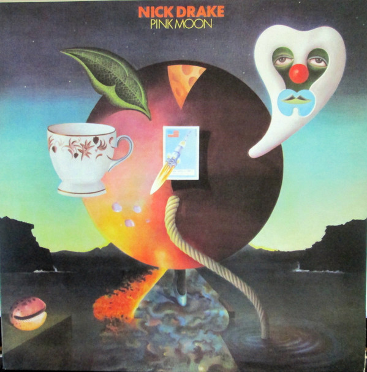

# Pink Moon

By Nick Drake

## Album Data

[Discogs URL](https://www.discogs.com/release/4330457-Nick-Drake-Pink-Moon)

- Label: Island Records
Universal Music Group International
- Formats: Vinyl, LP, Album, Reissue
- Genres: Rock, Folk, World, & Country, Acoustic, Folk, Folk Rock
- Rating: 4.62
- Released: 2013
- Year: 1972
- Release ID: 4330457
- Media condition: 
- Sleeve condition: 
- Speed: 
- Weight: 
- Notes: 

## Album Tracks

| **Position** | **Title** | **Duration** |
|--------------|-----------|--------------|
| A1 | **Pink Moon** |  |
| A2 | **Place To Be** |  |
| A3 | **Road** |  |
| A4 | **Which Will** |  |
| A5 | **Horn** |  |
| A6 | **Things Behind The Sun** |  |
| B1 | **Know** |  |
| B2 | **Parasite** |  |
| B3 | **Free Ride** |  |
| B4 | **Harvest Breed** |  |
| B5 | **From The Morning** |  |

## Artist Roles

| **Name** | **Role** |
|----------|----------|
| **Michael Trevithick** | Artwork [Cover] |
| **John Wood** | Engineer |
| **Sean Magee** | Lacquer Cut By [Runout Etching i…i] |
| **Keith Morris (8)** | Photography By [Inside Photograph] |
| **John Wood** | Producer |
| **Witchseason Productions Ltd.** | Producer |
| **CCS (2)** | Typography |
| **Nick Drake** | Vocals, Guitar, Piano |
| **Nick Drake** | Written-By |

