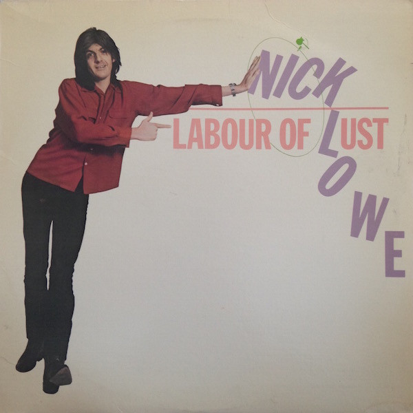

# Labour Of Lust

By Nick Lowe

## Album Data

[Discogs URL](https://www.discogs.com/release/654861-Nick-Lowe-Labour-Of-Lust)

- Label: Columbia
Columbia
- Formats: Vinyl, LP, Album
- Genres: Rock, Pop, New Wave, Power Pop, Pop Rock
- Rating: 4.18
- Released: 1979
- Year: 1979
- Release ID: 654861
- Media condition: 
- Sleeve condition: 
- Speed: 
- Weight: 
- Notes: 

## Album Tracks

| **Position** | **Title** | **Duration** |
|--------------|-----------|--------------|
| A1 | **Cruel To Be Kind** | 3:26 |
| A2 | **Cracking Up** | 2:57 |
| A3 | **Big Kick, Plain Scrap** | 2:27 |
| A4 | **American Squirm** | 2:29 |
| A5 | **You Make Me** | 1:49 |
| A6 | **Skin Deep** | 3:12 |
| B1 | **Switch Board Susan** | 3:46 |
| B2 | **Dose Of You** | 3:18 |
| B3 | **Without Love** | 2:27 |
| B4 | **Born Fighter** | 3:07 |
| B5 | **Love So Fine** | 3:52 |

## Artist Roles

| **Name** | **Role** |
|----------|----------|
| **Nick Lowe** | Producer |
| **Ian Gomm** | Written-By |
| **Mickey Jupp** | Written-By |
| **Nick Lowe** | Written-By |
| **Rockpile** | Written-By |

