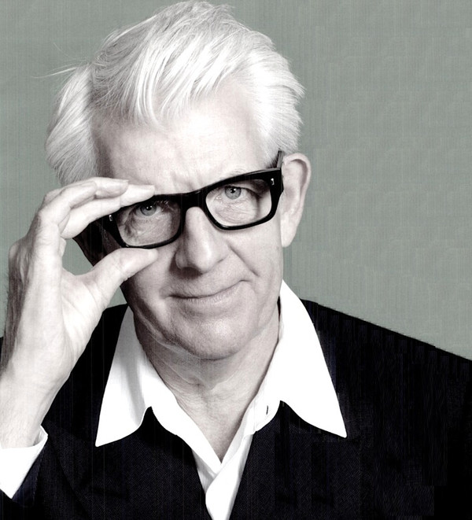

# Nick Lowe

## Artist Profile

English singer-songwriter, musician and producer, born 24 March 1949 in Walton-On-Thames, England, UK. He was married to Carlene Carter from 1979 to 1990 and now is married to Peta Waddington.

## Artist Links

- [http://nicklowe.com/](http://nicklowe.com/)
- [http://en.wikipedia.org/wiki/Nick_Lowe](http://en.wikipedia.org/wiki/Nick_Lowe)
- [https://nicklowe.bandcamp.com/music](https://nicklowe.bandcamp.com/music)

## See also

- [Labour Of Lust](Labour_Of_Lust.md)
- [Lovers Jamboree](Lovers_Jamboree.md)
