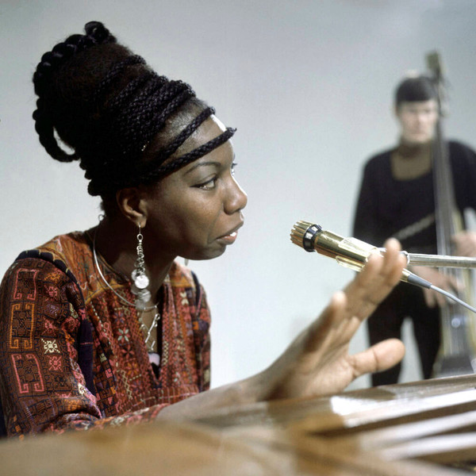

# Nina Simone

## Artist Profile

American singer, songwriter, pianist.

Born: 21 February 1933 in Tryon, North Carolina, USA.
Died: 21 April 2003 in Carry-le-Rouet, Bouches-du-Rhône, France (aged 70).

Nina was giving piano recitals after playing at her local church at an early age. Her childhood piano lessons were funded by her mother's employer and a local fund set up by her music teacher, so impressed were they by her talent.

She moved to Philadelphia aged 17, teaching piano and playing to raise the money for her studies at New York's renowned Juilliard School Of Music. To fund her family she worked in a bar in Atlantic City where she was also required to sing and built up a devoted following.

She recorded Gershwin's "I Loves You Porgy" which became a US Top 40 hit and transported her to a bigger stage, performing at Carnegie Hall and the Newport Jazz Festival.

Her repertoire went on to embrace numerous Civil Rights anthems, a movement for which she was a passionate and prominent supporter. She left the US in the 1970s, moving first to Barbados, and some other places, including Africa and the Netherlands, before eventually settling in France where she died from cancer in 2003.

Nina's voice drew heavily on other music forms. It was infused with gospel, blues, soul, jazz, R&B, and folk. And it found a wider audience late in her life when "My Baby Just Cares For Me" became an unlikely UK chart hit when it featured in a TV ad campaign.

In fact her music stayed very popular with advertisers as her tracks have been used to promote a multitude of products on TV, including yoghurt ("Ain't Got No (I Got Life)"), Diet Coke ("I Put A Spell On You"), cars ("Sinnerman"), fabric conditioner ("Feeling Good"), and perfume ("Don't Let Me Be Misunderstood"), et al.

## Artist Links

- [https://www.ninasimone.com/](https://www.ninasimone.com/)
- [http://boscarol.com/ninasimone/pages/nina/labels.php](http://boscarol.com/ninasimone/pages/nina/labels.php)
- [https://www.facebook.com/nina.simone/](https://www.facebook.com/nina.simone/)
- [https://twitter.com/NinaSimoneMusic](https://twitter.com/NinaSimoneMusic)
- [https://www.instagram.com/ninasimone](https://www.instagram.com/ninasimone)
- [https://www.tiktok.com/@ninasimone](https://www.tiktok.com/@ninasimone)
- [https://t.me/ninasimonemusic](https://t.me/ninasimonemusic)
- [https://www.youtube.com/user/NinaSimoneMusic](https://www.youtube.com/user/NinaSimoneMusic)
- [https://ninasimoneproject.org/](https://ninasimoneproject.org/)
- [https://en.wikipedia.org/wiki/Nina_Simone](https://en.wikipedia.org/wiki/Nina_Simone)
- [https://www.imdb.com/name/nm0800510/](https://www.imdb.com/name/nm0800510/)
- [https://myspace.com/ninasimone](https://myspace.com/ninasimone)
- [https://www.dailymotion.com/ninasimonemusic](https://www.dailymotion.com/ninasimonemusic)
- [https://vimeo.com/ninasimone](https://vimeo.com/ninasimone)
- [https://www.whosampled.com/Nina-Simone/](https://www.whosampled.com/Nina-Simone/)
- [https://www.youtube.com/user/NinaSimoneVEVO](https://www.youtube.com/user/NinaSimoneVEVO)

## See also

- [My Baby Just Cares For Me](My_Baby_Just_Cares_For_Me.md)
- [Nina Simone At Town Hall](Nina_Simone_At_Town_Hall.md)
