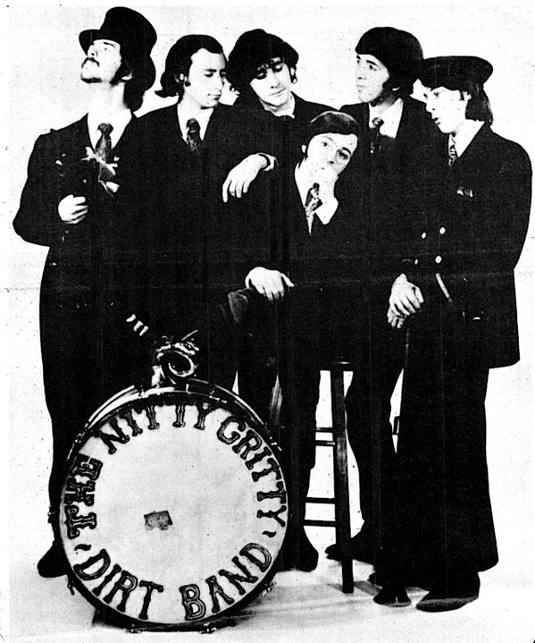

# Nitty Gritty Dirt Band

## Artist Profile

US American country rock band that has existed in various forms since its founding in Long Beach, California in 1966. The group's membership has had at least a dozen changes over the years, including a period from 1976 to 1981 when the band performed and recorded as The Dirt Band. Constant members since the early times are singer-guitarist Jeff Hanna and drummer Jimmie Fadden. Multi-instrumentalist John McEuen was with the band from 1966 to 1986 and returned during 2001. Keyboardist Bob Carpenter joined the band in 1977. The band is often cited as instrumental to the progression of contemporary country and roots music.

## Artist Links

- [http://www.nittygritty.com/](http://www.nittygritty.com/)
- [https://en.wikipedia.org/wiki/Nitty_Gritty_Dirt_Band](https://en.wikipedia.org/wiki/Nitty_Gritty_Dirt_Band)

## See also

- [Stars And Stripes Forever](Stars_And_Stripes_Forever.md)
