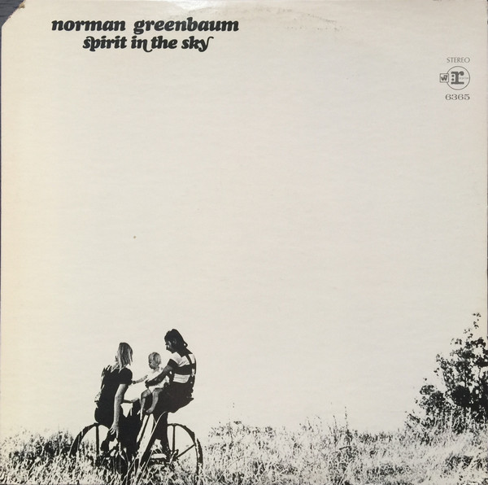

# Spirit In The Sky

By Norman Greenbaum

## Album Data

[Discogs URL](https://www.discogs.com/release/8760196-Norman-Greenbaum-Spirit-In-The-Sky)

- Label: Reprise Records
Reprise Records
- Formats: Vinyl, LP, Album
- Genres: Rock, Blues, Pop, Folk, World, & Country, Psychedelic Rock, Folk Rock, Blues Rock, Country Rock
- Rating: 4.1
- Released: 1969
- Year: 1969
- Release ID: 8760196
- Media condition: 
- Sleeve condition: 
- Speed: 
- Weight: 
- Notes: 

## Album Tracks

| **Position** | **Title** | **Duration** |
|--------------|-----------|--------------|
| A1 | **Junior Cadillac** | 3:32 |
| A2 | **Spirit In The Sky** | 3:57 |
| A3 | **Skyline** | 3:10 |
| A4 | **Jubilee** | 2:56 |
| A5 | **Alice Bodine** | 3:37 |
| B1 | **Tars Of India** | 3:00 |
| B2 | **The Power** | 2:33 |
| B3 | **Good Lookin' Woman** | 4:13 |
| B4 | **Milk Cow** | 3:00 |
| B5 | **Marcy** | 3:09 |

## Artist Roles

| **Name** | **Role** |
|----------|----------|
| **Bill Sabatini** | Performer [Songs Sung And Played By] |
| **Chuck Peterson** | Performer [Songs Sung And Played By] |
| **Dan Patiris** | Performer [Songs Sung And Played By] |
| **Doug Killmer** | Performer [Songs Sung And Played By] |
| **John Coppola** | Performer [Songs Sung And Played By] |
| **Joyce Stovall** | Performer [Songs Sung And Played By] |
| **Lillian Stovall** | Performer [Songs Sung And Played By] |
| **Mitzi (2)** | Performer [Songs Sung And Played By] |
| **Netta Stovall** | Performer [Songs Sung And Played By] |
| **Norman Greenbaum** | Performer [Songs Sung And Played By] |
| **Norman Mayell** | Performer [Songs Sung And Played By] |
| **Patty (16)** | Performer [Songs Sung And Played By] |
| **Robbie Robinson (8)** | Performer [Songs Sung And Played By] |
| **Russell Dashiel** | Performer [Songs Sung And Played By] |
| **William Truckaway** | Performer [Songs Sung And Played By] |
| **Lloyd Johnson** | Photography By |
| **Erik Jacobsen** | Producer |
| **Norman Greenbaum** | Written-By |

