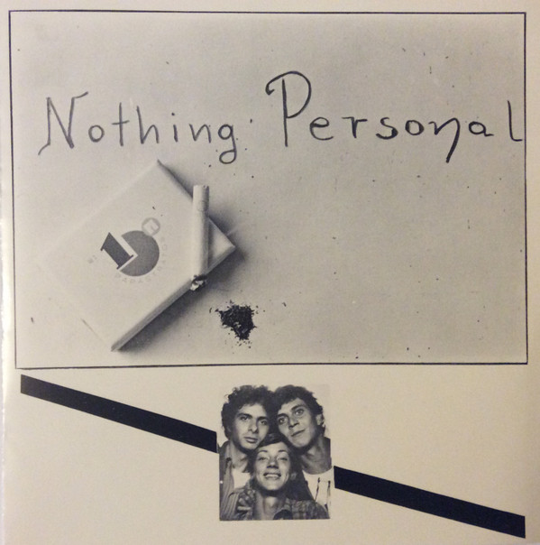

# Bon'g Da Lejje

By Nothing Personal

## Album Data

[Discogs URL](https://www.discogs.com/release/9770072-Nothing-Personal-Bong-Da-Lejje)

- Label: Riclou Anθhσia Records
- Formats: Vinyl, 7", 45 RPM, Single
- Genres: Rock, Punk
- Rating: 0
- Released: 1981
- Year: 1981
- Release ID: 9770072
- Media condition: 
- Sleeve condition: 
- Speed: 
- Weight: 
- Notes: 

## Album Tracks

| **Position** | **Title** | **Duration** |
|--------------|-----------|--------------|
| A | **Bon'g Da Lejje** |  |
| B | **On My Blok** |  |

