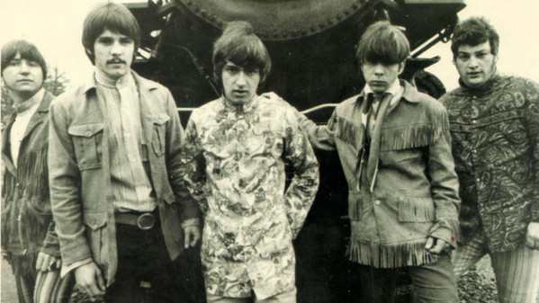

# Ohio Express

## Artist Profile

American bubblegum pop band, formed in Mansfield, Ohio, in 1967.

Though marketed as a band, it would be more accurate to say that "Ohio Express" served as a brand name used by Jerry Kasenetz's and Jeff Katz's Super K Production to release music by several different musicians and acts. The best known Ohio Express songs, including their highest charting single, "Yummy Yummy Yummy") were actually the work of an assemblage of studio musicians working out of New York, including singer/songwriter Joey Levine.

Several other "Ohio Express" hits were the work of other, unrelated musical groups, including the Rare Breed, and an early incarnation of 10cc. In addition, a completely separate touring version of Ohio Express appeared at all live dates, and recorded some of the band's album tracks.

Joey Levine: Vocals
Dale Power: Guitar
Doug Grassel: Guitar
Dean Kastran: Bass
Jim Pfahler: Keyboards
Tim Corwin: Drums

## Artist Links

- [http://en.wikipedia.org/wiki/Ohio_Express](http://en.wikipedia.org/wiki/Ohio_Express)

## See also

- [Yummy Yummy Yummy](Yummy_Yummy_Yummy.md)
