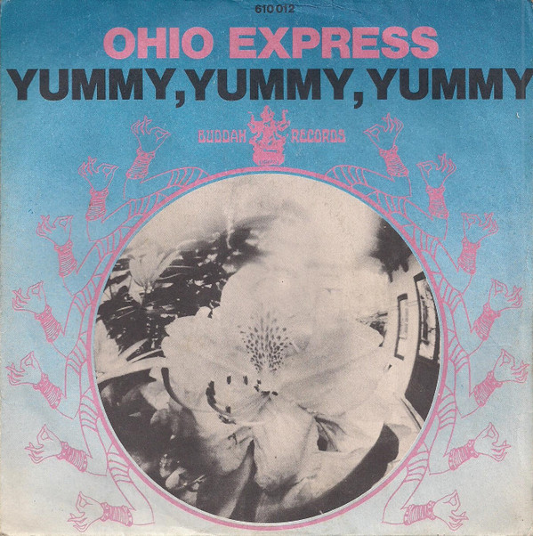

# Yummy Yummy Yummy

By Ohio Express

## Album Data

[Discogs URL](https://www.discogs.com/release/1326368-Ohio-Express-Yummy-Yummy-Yummy)

- Label: Buddah Records
- Formats: Vinyl, 7", 45 RPM, Single, Styrene
- Genres: Rock, Pop, Bubblegum, Pop Rock, Vocal, Novelty
- Rating: 3.76
- Released: 1968-04-00
- Year: 1968
- Release ID: 1326368
- Media condition: 
- Sleeve condition: 
- Speed: 
- Weight: 
- Notes: 

## Album Tracks

| **Position** | **Title** | **Duration** |
|--------------|-----------|--------------|
| A | **Yummy Yummy Yummy** | 2:18 |
| B | **Zig Zag** | 2:05 |

## Artist Roles

| **Name** | **Role** |
|----------|----------|
| **Arthur Resnick** | Producer |
| **Jeff Katz** | Producer |
| **Jerry Kasenetz** | Producer |
| **Joey Levine** | Producer |

