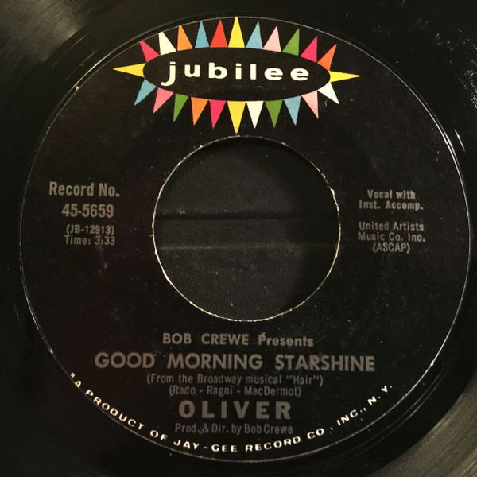

# Good Morning Starshine 

By Oliver

## Album Data

[Discogs URL](https://www.discogs.com/release/7608051-Oliver-Good-Morning-Starshine-)

- Label: Jubilee
- Formats: Vinyl, 7", 45 RPM, Single, Styrene
- Genres: Rock, Rock & Roll, Musical
- Rating: 4.5
- Released: 1969
- Year: 1969
- Release ID: 7608051
- Media condition: 
- Sleeve condition: 
- Speed: 
- Weight: 
- Notes: 

## Album Tracks

| **Position** | **Title** | **Duration** |
|--------------|-----------|--------------|
| A | **Good Morning Starshine** | 3:33 |
| B | **Can't You See** | 2:42 |

## Artist Roles

| **Name** | **Role** |
|----------|----------|
| **Bob Crewe** | Producer, Directed By |

