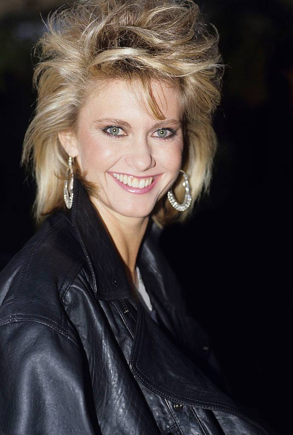

# Olivia Newton-John

## Artist Profile

English-Australian singer and actress, born 26 September 1948 in Cambridge, England, UK; died 8 August 2022 in Santa Ynez Valley, California, USA.

Mother of Chloe Lattanzi.
AO—Order of Australia
OBE—Officer of the Most Excellent Order of the British Empire

## Artist Links

- [https://olivianewton-john.com/](https://olivianewton-john.com/)
- [https://www.facebook.com/olivianewtonjohn](https://www.facebook.com/olivianewtonjohn)
- [https://www.livonmusic.com/](https://www.livonmusic.com/)
- [https://en.wikipedia.org/wiki/Olivia_Newton-John](https://en.wikipedia.org/wiki/Olivia_Newton-John)
- [https://www.imdb.com/name/nm0000556/](https://www.imdb.com/name/nm0000556/)
- [https://www.youtube.com/channel/UCm3MHjUa5oXEKRe-yMx2Fvg/](https://www.youtube.com/channel/UCm3MHjUa5oXEKRe-yMx2Fvg/)
- [https://morethanphysical.blogspot.com/](https://morethanphysical.blogspot.com/)
- [https://newtonjohn.blogspot.com/](https://newtonjohn.blogspot.com/)
- [https://twitter.com/olivianj](https://twitter.com/olivianj)
- [http://www.10538overture.dk/Related%20bands/Olivia%20Newton%20John/Fronts/olivia_newton_john_history.html](http://www.10538overture.dk/Related%20bands/Olivia%20Newton%20John/Fronts/olivia_newton_john_history.html)

## See also

- [Make A Move On Me](Make_A_Move_On_Me.md)
- [Physical](Physical.md)
