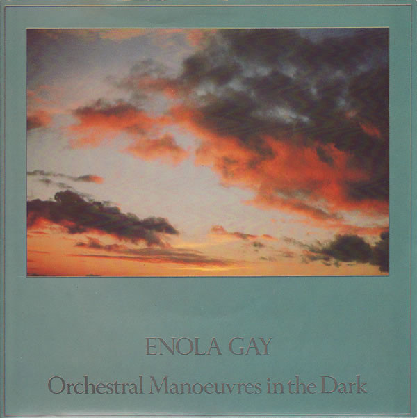

# Enola Gay

By Orchestral Manoeuvres In The Dark

## Album Data

[Discogs URL](https://www.discogs.com/release/99647-Orchestral-Manoeuvres-In-The-Dark-Enola-Gay)

- Label: Dindisc
- Formats: Vinyl, 7", 45 RPM, Single, Stereo
- Genres: Electronic, Synth-pop
- Rating: 4.4
- Released: 1980-09-26
- Year: 1980
- Release ID: 99647
- Media condition: 
- Sleeve condition: 
- Speed: 
- Weight: 
- Notes: 

## Album Tracks

| **Position** | **Title** | **Duration** |
|--------------|-----------|--------------|
| A | **Enola Gay** | 3:36 |
| B | **Annex** | 4:32 |

## Artist Roles

| **Name** | **Role** |
|----------|----------|
| **Ray Staff** | Lacquer Cut By |
| **Mike Howlett** | Producer |
| **Orchestral Manoeuvres In The Dark** | Producer |

