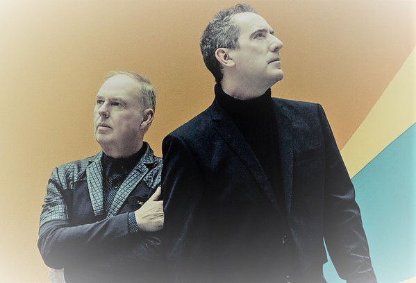

# Orchestral Manoeuvres In The Dark

## Artist Profile

English electronic band formed in Wirral, Merseyside, in 1978 with Paul Humphreys (synthesizers) and Andy McCluskey (vocals and bass guitar). Earlier incarnations of their band included 'VCL XI' and 'Hitlerz Underpantz'.

They played their first gig in 1978 at Eric's (Liverpool), then had a run of UK chart hits after swapping labels from Factory to the Virgin owned label DinDisc starting with the 1980 release 'Messages'. In 1980, drummer Malcolm Holmes and Dave Hughes on synths transitioned from guest/live musicians to be full members of the band. Hughes left 1980 and was replaced by Martin Cooper. 
Humphreys left the group in 1989, but McCluskey made a comeback in 1991 with the UK top 5 'Sailing On The Seven Seas', and followed that up with a UK top 3 Album 'Sugar Tax' before finally calling it a day in 1996.
In 2007 they toured together again featuring the classic line-up of Andy McCluskey, Paul Humphreys, Malcolm Holmes and Martin Cooper and released a live-album in 2008: 'OMD Live: Architecture & Morality & More'. September 2010 saw the release of History Of Modern featuring the original classic line-up. This has been followed by English Electric (2013) & The Punishment of Luxury (2017) and OMD also performs live extensively.

## Artist Links

- [https://www.omd.uk.com/](https://www.omd.uk.com/)
- [http://www.discog.info/OMD.html](http://www.discog.info/OMD.html)
- [https://www.facebook.com/omdofficial/](https://www.facebook.com/omdofficial/)
- [https://twitter.com/officialomd](https://twitter.com/officialomd)
- [https://en.wikipedia.org/wiki/Orchestral_Manoeuvres_in_the_Dark](https://en.wikipedia.org/wiki/Orchestral_Manoeuvres_in_the_Dark)
- [https://www.youtube.com/user/OMDenglishelectric](https://www.youtube.com/user/OMDenglishelectric)
- [https://officialomd.bandcamp.com/](https://officialomd.bandcamp.com/)

## See also

- [Enola Gay](Enola_Gay.md)
- [Souvenir](Souvenir.md)
