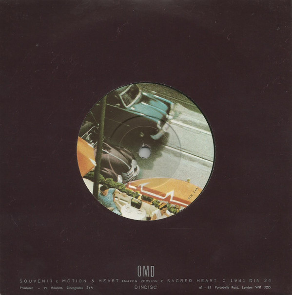

# Souvenir

By Orchestral Manoeuvres In The Dark

## Album Data

[Discogs URL](https://www.discogs.com/release/55815-OMD-Souvenir)

- Label: Dindisc
- Formats: Vinyl, 7", 45 RPM, Single
- Genres: Electronic, Pop, Synth-pop
- Rating: 4.3
- Released: 1981-08-04
- Year: 1981
- Release ID: 55815
- Media condition: 
- Sleeve condition: 
- Speed: 
- Weight: 
- Notes: 

## Album Tracks

| **Position** | **Title** | **Duration** |
|--------------|-----------|--------------|
|  | **Sceneside** |  |
| A | **Souvenir** | 3:37 |
|  | **Typeside** |  |
| B1 | **Motion & Heart (Amazon Version)** | 3:07 |
| B2 | **Sacred Heart** | 3:27 |

## Artist Roles

| **Name** | **Role** |
|----------|----------|
| **BilBo (3)** | Lacquer Cut By |

