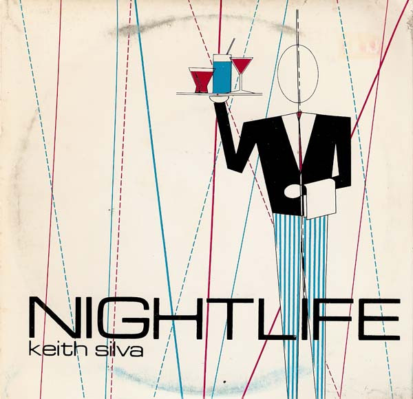

# Nightlife / Raincoats & Silverware

By Our Daughter's Wedding

## Album Data

[Discogs URL](https://www.discogs.com/release/735629-Our-Daughters-Wedding-Nightlife-Raincoats-Silverware)

- Label: Design Records
- Formats: Vinyl, 7", Single, 45 RPM
- Genres: Electronic, Synth-pop, Minimal
- Rating: 4.44
- Released: 1980
- Year: 1980
- Release ID: 735629
- Media condition: 
- Sleeve condition: 
- Speed: 
- Weight: 
- Notes: 

## Album Tracks

| **Position** | **Title** | **Duration** |
|--------------|-----------|--------------|
| A | **Nightlife** | 3:16 |
| B | **Raincoats & Silverware** | 4:20 |

## Artist Roles

| **Name** | **Role** |
|----------|----------|
| **Richard Van Dorn** | Engineer |
| **David Gold (3)** | Lacquer Cut By |
| **Keith Silva** | Music By |
| **Layne Rico** | Music By |
| **V. Wilkinson** | Music By |
| **Barry Rico** | Photography By [Back Cover Photo] |
| **Rico West** | Producer |
| **Layne Rico** | Synthesizer [Synare, Synthesizers], Voice [B Voice], Artwork |
| **Keith Silva** | Voice, Keyboards |
| **Keith Silva** | Words By |
| **Layne Rico** | Words By |

