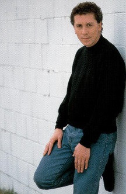

# Paul Hardcastle

## Artist Profile

British electronic producer, multi-instrumentalist musician, songwriter, and artist. 

Born: 10 December 1957 in Kensington, London, England, UK. 

Hardcastle enjoyed success on the underground dance scene in the early 1980s before, under the management of Simon Fuller (2), breaking into the mainstream with his hit single"19", an international smash which spent five weeks at number one in the UK. In the latter half of the 1980s he specialised in TV soundtrack work, and now records mainly under the pseudonym The Jazzmasters. 

Due to contractual restrictions he was unable to release music under the Hardcastle name. So under the pseudonym The Deff Boyz, he released a 12" single entitled "Swing" (1990), which crashed in at #4 on Billboards 12" sales chart and was a massive hit all over Europe. Another project under the name LFO also saw massive sales. 

In 1997, Paul did some work for the movie "Spice World", later working as a radio presenter in the US. He has sold over 20 million records worldwide. 

He is married to his teenage sweetheart Dolores Hardcastle (born Dolore Baker) and together they have 3 children: Maxine Hardcastle, Paul Hardcastle Jr., and Richard Hardcastle. 
His younger sister is Susan Hardcastle, who lent her voice to the backing vocals for the song "Fooling Yourself". 

## Artist Links

- [https://www.paulhardcastle.com](https://www.paulhardcastle.com)
- [https://www.trippinrecords.com](https://www.trippinrecords.com)
- [https://www.paul-hardcastle.de](https://www.paul-hardcastle.de)
- [https://www.myspace.com/paulhardcastleofficial](https://www.myspace.com/paulhardcastleofficial)
- [https://www.myspace.com/zerooneofficial](https://www.myspace.com/zerooneofficial)
- [https://en.wikipedia.org/wiki/Paul_Hardcastle](https://en.wikipedia.org/wiki/Paul_Hardcastle)
- [https://www.imdb.com/name/nm0362058](https://www.imdb.com/name/nm0362058)
- [https://soundcloud.com/paulhardcastle](https://soundcloud.com/paulhardcastle)
- [https://www.whosampled.com/Paul-Hardcastle](https://www.whosampled.com/Paul-Hardcastle)

## See also

- [19](19.md)
