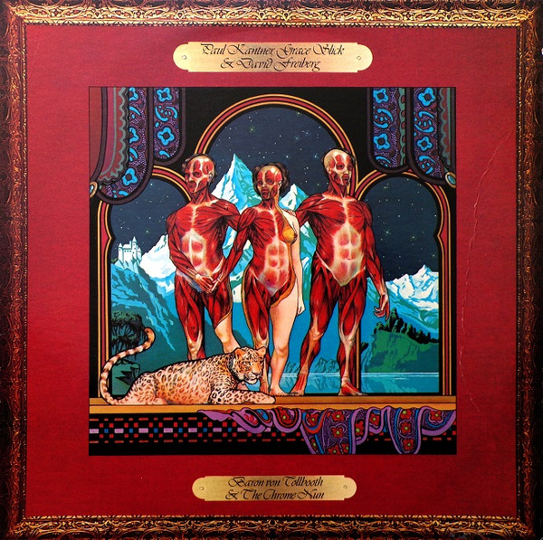

# Baron Von Tollbooth & The Chrome Nun

By Paul Kantner

## Album Data

[Discogs URL](https://www.discogs.com/release/2588911-Paul-Kantner-Grace-Slick-David-Freiberg-Baron-Von-Tollbooth-The-Chrome-Nun)

- Label: Grunt (3)
- Formats: Vinyl, LP, Album, Stereo
- Genres: Rock, Rock & Roll, Psychedelic Rock
- Rating: 3.83
- Released: 1973
- Year: 1973
- Release ID: 2588911
- Media condition: 
- Sleeve condition: 
- Speed: 
- Weight: 
- Notes: 

## Album Tracks

| **Position** | **Title** | **Duration** |
|--------------|-----------|--------------|
| A1 | **Ballad Of The Chrome Nun** | 3:59 |
| A2 | **Fat** | 3:13 |
| A3 | **Flowers Of The Night** | 4:13 |
| A4 | **Walkin** | 2:31 |
| A5 | **Your Mind Has Left Your Body** | 5:45 |
| B1 | **Across The Board** | 4:34 |
| B2 | **Harp Tree Lament** | 3:34 |
| B3 | **White Boy** | 4:13 |
| B4 | **Fishman** | 2:40 |
| B5 | **Sketches Of China** | 5:13 |

## Artist Roles

| **Name** | **Role** |
|----------|----------|
| **Jack Traylor** | Acoustic Guitar |
| **Chris Ethridge** | Bass |
| **Jack Casady** | Bass |
| **John Barbata** | Drums, Percussion |
| **Mickey Hart** | Gong [Gongs] |
| **Craig Chaquico** | Lead Guitar |
| **Jorma Kaukonen** | Lead Guitar |
| **David Freiberg** | Piano, Vocals, Keyboards |
| **David Freiberg** | Producer |
| **Grace Slick** | Producer |
| **Paul Kantner** | Producer |
| **Jerry Garcia** | Steel Guitar, Lead Guitar |
| **Papa John Creach** | Violin |
| **David Crosby** | Vocals |
| **Jack Traylor** | Vocals |
| **Pointer Sisters** | Vocals |
| **Grace Slick** | Vocals, Piano |
| **Paul Kantner** | Vocals, Rhythm Guitar |

