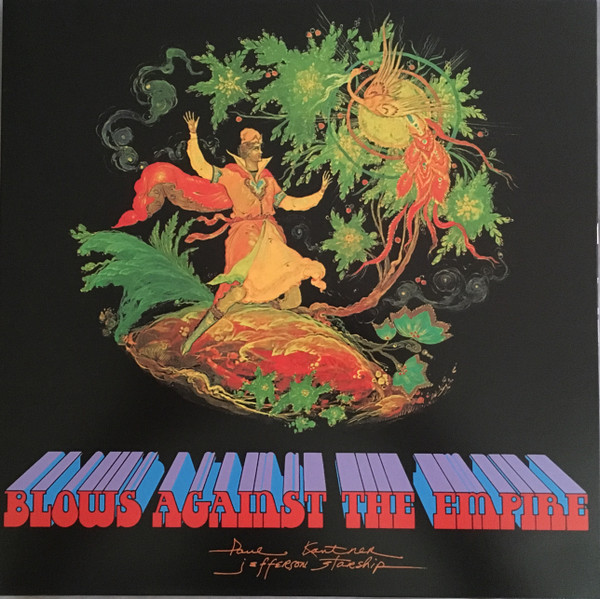

# Blows Against The Empire

By Paul Kantner

## Album Data

[Discogs URL](https://www.discogs.com/release/2508413-Paul-Kantner-Jefferson-Starship-Blows-Against-The-Empire)

- Label: RCA Victor
Music On Vinyl
RCA
Legacy
- Formats: Vinyl, LP, Album, Reissue
- Genres: Rock, Classic Rock
- Rating: 4.25
- Released: 2009
- Year: 1970
- Release ID: 2508413
- Media condition: 
- Sleeve condition: 
- Speed: 
- Weight: 
- Notes: 

## Album Tracks

| **Position** | **Title** | **Duration** |
|--------------|-----------|--------------|
| A1 | **Mau Mau (Amerikon)** |  |
| A2 | **The Baby Tree** |  |
| A3 | **Let's Go Together** |  |
| A4 | **A Child Is Coming** |  |
| B1 | **Sunrise** |  |
| B2 | **Hijack** |  |
| B3 | **Home** |  |
| B4 | **Have You Seen The Stars Tonite** |  |
| B5 | **X-M** |  |
| B6 | **Starship** |  |

## Artist Roles

| **Name** | **Role** |
|----------|----------|
| **Paul Kantner** | Guitar, Vocals, Banjo, Bass [Bass Machine] |
| **Grace Slick** | Piano, Vocals |
| **Paul Kantner** | Producer |

