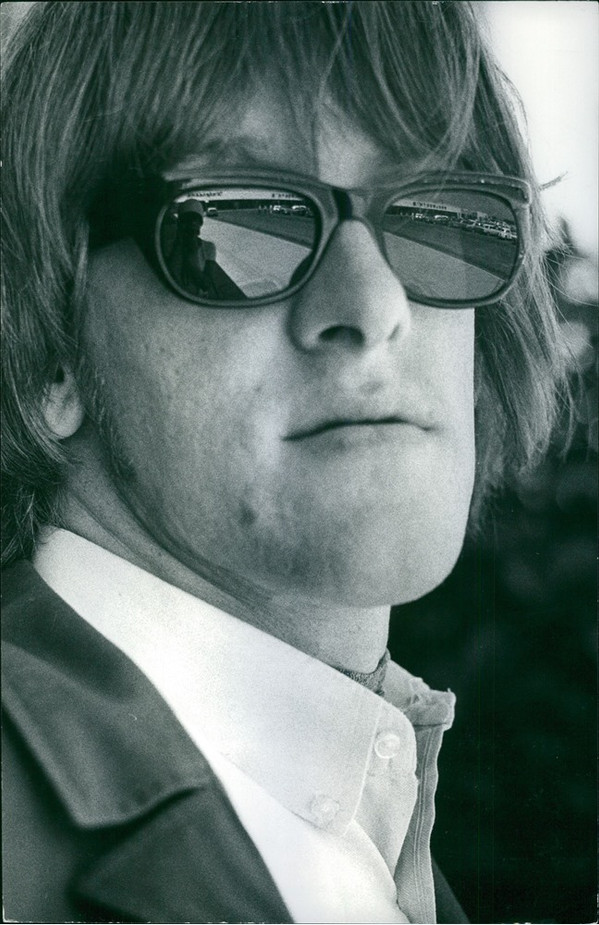

# Paul Kantner

## Artist Profile

Paul Lorin Kantner (March 17, 1941, San Francisco, California, U.S.A. – January 28, 2016, San Francisco, California, U.S.A.) was an American vocalist, guitarist and songwriter known for co-founding Jefferson Airplane, a psychedelic rock band of the counterculture era, and its more commercial spin-off band Jefferson Starship. Father of China Wing Kantner.

## Artist Links

- [https://en.wikipedia.org/wiki/Paul_Kantner](https://en.wikipedia.org/wiki/Paul_Kantner)
- [https://www.imdb.com/name/nm0437939/](https://www.imdb.com/name/nm0437939/)
- [https://www.britannica.com/biography/Paul-Kantner](https://www.britannica.com/biography/Paul-Kantner)

## See also

- [Baron Von Tollbooth & The Chrome Nun](Baron_Von_Tollbooth_and_The_Chrome_Nun.md)
- [Blows Against The Empire](Blows_Against_The_Empire.md)
- [Sunfighter](Sunfighter.md)
