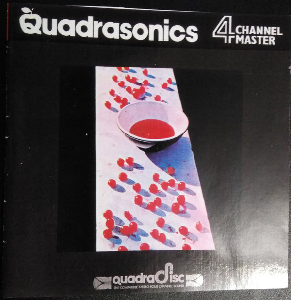

# McCartney

By Paul McCartney

## Album Data

[Discogs URL](https://www.discogs.com/release/2942758-McCartney-McCartney)

- Label: MPL (2)
Hear Music
Concord Music Group
Universal Music Group International
- Formats: Vinyl, LP, Album, Reissue, Remastered
- Genres: Rock, Pop
- Rating: 4.51
- Released: 2011-06-13
- Year: 1970
- Release ID: 2942758
- Media condition: 
- Sleeve condition: 
- Speed: 
- Weight: 
- Notes: 

## Album Tracks

| **Position** | **Title** | **Duration** |
|--------------|-----------|--------------|
| A1 | **The Lovely Linda** | 0:42 |
| A2 | **That Would Be Something** | 2:38 |
| A3 | **Valentine Day** | 1:40 |
| A4 | **Every Night** | 2:33 |
| A5 | **Hot As Sun/Glasses** | 2:06 |
| A6 | **Junk** | 1:54 |
| A7 | **Man We Was Lonely** | 2:57 |
| B1 | **Oo You** | 2:49 |
| B2 | **Momma Miss America** | 4:05 |
| B3 | **Teddy Boy** | 2:23 |
| B4 | **Singalong Junk** | 2:35 |
| B5 | **Maybe I'm Amazed** | 3:48 |
| B6 | **Kreen-Akrore** | 4:10 |
| C1 | **Suicide (Out-Take)** | 2:46 |
| C2 | **Maybe I'm Amazed (From One Hand Clapping)** | 4:51 |
| C3 | **Every Night (Live At Glasgow, 1979)** | 4:30 |
| D1 | **Hot As Sun (Live At Glasgow, 1979)** | 2:26 |
| D2 | **Maybe I'm Amazed (Live At Glasgow, 1979)** | 5:10 |
| D3 | **Don't Cry Baby (Out-Take)** | 3:06 |
| D4 | **Women Kind (Demo) (Mono)** | 2:05 |

## Artist Roles

| **Name** | **Role** |
|----------|----------|
| **Paul McCartney** | Composed By |
| **Roger Huggett** | Consultant [Creative Consultant] |
| **Claudia Schmid** | Coordinator [Artwork & Photographic Co-ordinator] |
| **Lisa Power** | Coordinator [Audio Co-ordinators] |
| **Ruth Birch** | Coordinator [Audio Co-ordinators] |
| **Susanne Buckner** | Coordinator [Film Co-ordinator] |
| **Allan Rouse** | Coordinator [Remastering Project Co-ordinator] |
| **YES (5)** | Creative Director, Design [Redesign] |
| **Paul McCartney** | Executive-Producer |
| **Linda McCartney** | Harmony Vocals [Harmonies] |
| **Paul McCartney** | Instruments, Voice |
| **Geoff Emerick** | Mixed By |
| **Eddie Klein** | Other [MPL Audio Archive] |
| **Dave Bogart** | Other [Publishing & Copyright] |
| **Jane Kett** | Other [Publishing & Copyright] |
| **Nancy Jeffries** | Other [Publishing & Copyright] |
| **Paul & Linda McCartney** | Photography By [All Other Photographs] |
| **Linda McCartney** | Photography By [Front & Back Cover Photographs] |
| **Paul McCartney** | Producer |
| **Scott Roger** | Project Manager |
| **Eddie Klein** | Recorded By |
| **Mark Vigars** | Recorded By |
| **Geoff Emerick** | Recorded By, Mixed By |
| **Paul McCartney** | Recorded By, Mixed By |
| **Guy Massey** | Remastered By |
| **Steve Rooke** | Remastered By |
| **Toby McColl** | Research [Additional Research] |
| **Catherine Shepherd** | Research [Photographic & Artwork Research] |
| **Rebecca Church** | Research [Photographic & Artwork Research] |
| **Richard Miller (5)** | Research [Photographic & Artwork Research] |
| **Paul McCartney** | Songwriter |

