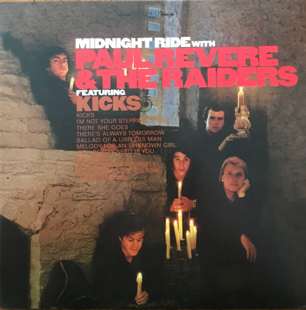

# Midnight Ride

By Paul Revere & The Raiders

## Album Data

[Discogs URL](https://www.discogs.com/release/8927595-Paul-Revere-The-Raiders-Midnight-Ride)

- Label: Friday Music
Columbia
Sony Music Commercial Music Group
- Formats: Vinyl, LP, Album, Limited Edition, Reissue, Remastered, Stereo
- Genres: Rock, Pop, Garage Rock, Vocal
- Rating: 4.35
- Released: 2016-08-05
- Year: 1966
- Release ID: 8927595
- Media condition: 
- Sleeve condition: 
- Speed: 
- Weight: 
- Notes: 

## Album Tracks

| **Position** | **Title** | **Duration** |
|--------------|-----------|--------------|
| A1 | **Kicks** |  |
| A2 | **There's Always Tomorrow** |  |
| A3 | **Little Girl In The 4th Row** |  |
| A4 | **Ballad Of A Useless Man** |  |
| A5 | **I'm Not Your Stepping Stone** |  |
| A6 | **There She Goes** |  |
| B1 | **All I Really Need Is You** |  |
| B2 | **Get It On** |  |
| B3 | **Louie, Go Home** |  |
| B4 | **Take A Look At Yourself** |  |
| B5 | **Melody For An Unknown Girl** |  |

## Artist Roles

| **Name** | **Role** |
|----------|----------|
| **Paul Revere & The Raiders** | Arranged By |
| **Terry Melcher** | Arranged By |
| **Roger Hart (2)** | Coordinator [Music] |
| **Drake Levin** | Performer |
| **Mark Lindsay** | Performer |
| **Mike Smith (34)** | Performer |
| **Paul Revere** | Performer |
| **Phil Volk** | Performer |
| **Guy Webster** | Photography By [Cover] |
| **Dean Martin Jr.** | Tambourine, Maracas |
| **Keith Allison** | Tambourine, Maracas |

