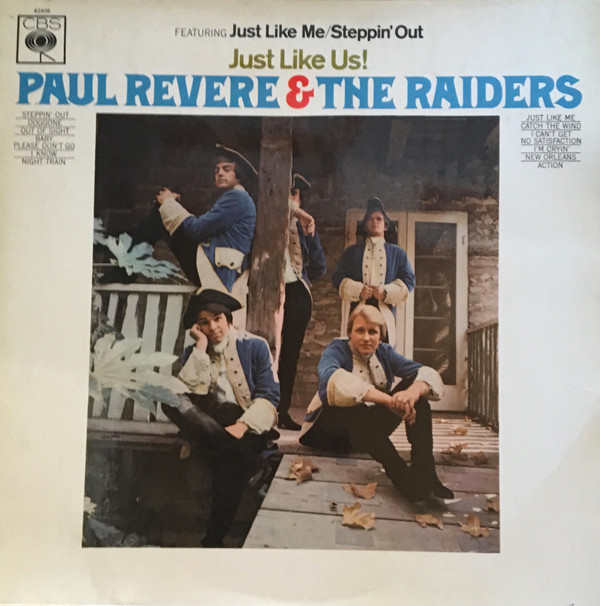

# Just Like Us!

By Paul Revere & The Raiders

## Album Data

[Discogs URL](https://www.discogs.com/release/2311990-Paul-Revere-The-Raiders-Just-Like-Us)

- Label: Columbia
- Formats: Vinyl, LP, Album, Mono
- Genres: Rock, Pop, Beat, Garage Rock
- Rating: 3.64
- Released: 1966
- Year: 1966
- Release ID: 2311990
- Media condition: 
- Sleeve condition: 
- Speed: 
- Weight: 
- Notes: 

## Album Tracks

| **Position** | **Title** | **Duration** |
|--------------|-----------|--------------|
| A1 | **Steppin' Out** | 2:13 |
| A2 | **Doggone** | 2:50 |
| A3 | **Out Of Sight** | 2:35 |
| A4 | **Baby, Please Don't Go** | 2:30 |
| A5 | **I Know** | 2:30 |
| A6 | **Night Train** | 2:30 |
| B1 | **Just Like Me** | 2:23 |
| B2 | **Catch The Wind** | 2:00 |
| B3 | **I Can't Get No Satisfaction** | 3:18 |
| B4 | **I'm Cryin'** | 3:05 |
| B5 | **New Orleans** | 2:57 |
| B6 | **Action** | 1:28 |

## Artist Roles

| **Name** | **Role** |
|----------|----------|
| **Phil Volk** | Bass |
| **Roger Hart (2)** | Coordinator |
| **Mike Smith (34)** | Drums |
| **Drake Levin** | Lead Guitar |
| **Dick Clark (2)** | Liner Notes [Back Cover] |
| **Paul Revere** | Liner Notes [Back Cover] |
| **Roger Hart (2)** | Liner Notes [Back Cover] |
| **Roger Hart (2)** | Management |
| **Paul Revere** | Organ |
| **Guy Webster** | Photography By [Front Cover] |
| **Terry Melcher** | Producer |
| **Mark Lindsay** | Saxophone |
| **Mark Lindsay** | Vocals |

