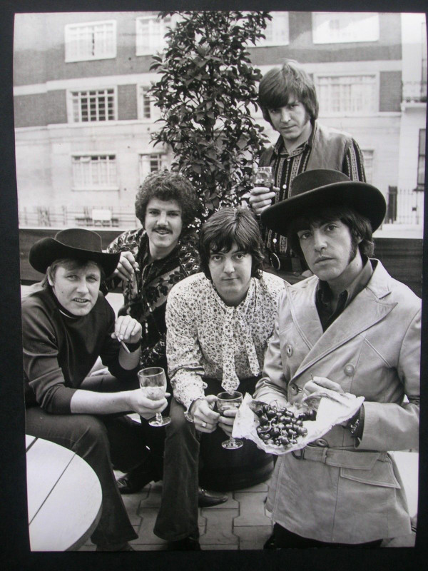

# Paul Revere & The Raiders

## Artist Profile

US rock & roll group originally named "The Downbeats" from Idaho, later relocated to Oregon in 1962.
Changed their name to The Raiders in 1970.

## Artist Links

- [http://www.paulrevereandtheraiders.com/](http://www.paulrevereandtheraiders.com/)
- [http://www.myspace.com/paulrevereraiders](http://www.myspace.com/paulrevereraiders)
- [http://en.wikipedia.org/wiki/Paul_Revere_and_The_Raiders](http://en.wikipedia.org/wiki/Paul_Revere_and_The_Raiders)
- [http://www.whosampled.com/Paul-Revere-%26-the-Raiders/](http://www.whosampled.com/Paul-Revere-%26-the-Raiders/)
- [https://books.discogs.com/credit/678903-paul-revere-the-raiders](https://books.discogs.com/credit/678903-paul-revere-the-raiders)

## See also

- [Just Like Us!](Just_Like_Us!.md)
- [Midnight Ride](Midnight_Ride.md)
- [The Spirit Of '67](The_Spirit_Of_67.md)
