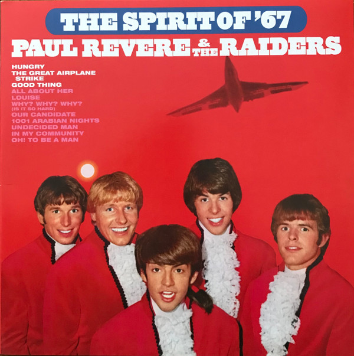

# The Spirit Of '67

By Paul Revere & The Raiders

## Album Data

[Discogs URL](https://www.discogs.com/release/7546935-Paul-Revere-The-Raiders-The-Spirit-Of-67)

- Label: Friday Music
Columbia
Sony Music
- Formats: Vinyl, LP, Album, Limited Edition, Reissue, Remastered
- Genres: Rock, Pop, Vocal, Garage Rock
- Rating: 3.82
- Released: 2015-07-15
- Year: 1966
- Release ID: 7546935
- Media condition: 
- Sleeve condition: 
- Speed: 
- Weight: 
- Notes: 

## Album Tracks

| **Position** | **Title** | **Duration** |
|--------------|-----------|--------------|
| A1 | **Good Thing** |  |
| A2 | **All About Her** |  |
| A3 | **In My Community** |  |
| A4 | **Louise** |  |
| A5 | **Why, Why Why? (Is It So Hard)** |  |
| A6 | **Oh! To Be A Man** |  |
| B1 | **Hungry** |  |
| B2 | **Undecided Man** |  |
| B3 | **Our Candidate** |  |
| B4 | **1001 Arabian Nights** |  |
| B5 | **The Great Airplane Strike** |  |

## Artist Roles

| **Name** | **Role** |
|----------|----------|
| **Joe Reagoso** | Mastered By |
| **Terry Melcher** | Producer |

