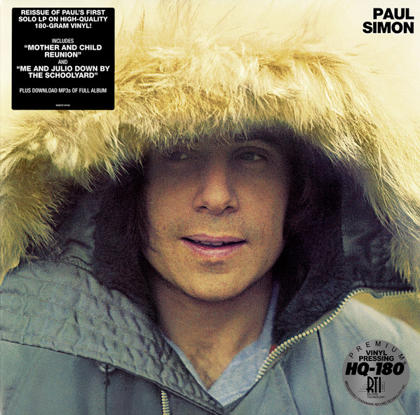

# Paul Simon

By Paul Simon

## Album Data

[Discogs URL](https://www.discogs.com/release/7624215-Paul-Simon-Paul-Simon)

- Label: Columbia
- Formats: Vinyl, LP, Album, Reissue, Remastered
- Genres: Rock, Folk Rock, Pop Rock
- Rating: 4.69
- Released: 2013-11-30
- Year: 1972
- Release ID: 7624215
- Media condition: 
- Sleeve condition: 
- Speed: 
- Weight: 
- Notes: 

## Album Tracks

| **Position** | **Title** | **Duration** |
|--------------|-----------|--------------|
| A1 | **Mother And Child Reunion** | 3:05 |
| A2 | **Duncan** | 4:39 |
| A3 | **Everything Put Together Falls Apart** | 1:59 |
| A4 | **Run That Body Down** | 3:52 |
| A5 | **Armistice Day** | 3:55 |
| B1 | **Me And Julio Down By The Schoolyard** | 2:42 |
| B2 | **Peace Like A River** | 3:20 |
| B3 | **Papa Hobo** | 2:34 |
| B4 | **Hobo's Blues** | 1:21 |
| B5 | **Paranoia Blues** | 2:54 |
| B6 | **Congratulations** | 3:42 |

## Artist Roles

| **Name** | **Role** |
|----------|----------|
| **Paul Simon** | Composed By |
| **Stéphane Grappelli** | Composed By |
| **John Berg** | Design |
| **Ron Coro** | Design |
| **Roy Halee** | Engineer |
| **P.A. Harper** | Photography By |
| **Paul Simon** | Producer |
| **Roy Halee** | Producer |
| **Ryan Smith (2)** | Remastered By |

