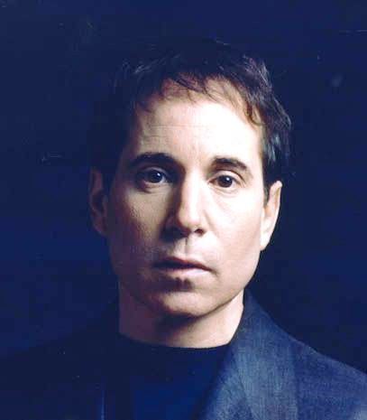

# Paul Simon

## Artist Profile

American singer-songwriter born October 13, 1941, Newark, New Jersey, USA, who rose to fame as one part of Simon &amp; Garfunkel. After splitting up with Art Garfunkel, he went on to have a successful solo career. Inducted into Rock And Roll Hall of Fame in 2001 (Performer).

His first marriage was to Peggy Harper with whom he had a son Harper Simon. He was then briefly married to Carrie Fisher from 1983 until their divorce in 1984. His third wife is folk singer Edie Brickell.

## Artist Links

- [http://www.paulsimon.com/](http://www.paulsimon.com/)
- [https://en.wikipedia.org/wiki/Paul_Simon](https://en.wikipedia.org/wiki/Paul_Simon)
- [https://www.imdb.com/name/nm0800328/](https://www.imdb.com/name/nm0800328/)
- [https://www.facebook.com/paulsimon](https://www.facebook.com/paulsimon)

## See also

- [Paul Simon](Paul_Simon.md)
- [There Goes Rhymin' Simon](There_Goes_Rhymin_Simon.md)
