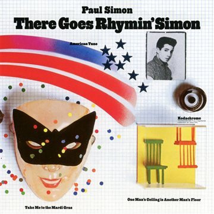

# There Goes Rhymin' Simon

By Paul Simon

## Album Data

[Discogs URL](https://www.discogs.com/release/5153783-Paul-Simon-There-Goes-Rhymin-Simon)

- Label: Columbia
Columbia
- Formats: Vinyl, LP, Limited Edition, Numbered
- Genres: Rock, Folk Rock, Pop Rock
- Rating: 4.51
- Released: 2013
- Year: 1973
- Release ID: 5153783
- Media condition: 
- Sleeve condition: 
- Speed: 
- Weight: 
- Notes: 

## Album Tracks

| **Position** | **Title** | **Duration** |
|--------------|-----------|--------------|
| A1 | **Kodachrome** | 3:32 |
| A2 | **Tenderness** | 2:53 |
| A3 | **Take Me To The Mardi Gras** | 3:32 |
| A4 | **Something So Right** | 4:34 |
| A5 | **One Man's Ceiling Is Another Man's Floor** | 3:44 |
| B1 | **American Tune** | 3:44 |
| B2 | **Was A Sunny Day** | 3:40 |
| B3 | **Learn How To Fall** | 2:45 |
| B4 | **St. Judy's Comet** | 3:19 |
| B5 | **Loves Me Like A Rock** | 3:32 |

## Artist Roles

| **Name** | **Role** |
|----------|----------|
| **Bob Cranshaw** | Bass |
| **David Hood** | Bass |
| **Muscle Shoals Rhythm Section** | Co-producer |
| **Phil Ramone** | Co-producer |
| **Roger Hawkins** | Drums |
| **Rich Blakin** | Engineer [Assistant] |
| **Jerry Masters** | Engineer [Supervising] |
| **Phil Ramone** | Engineer [Supervising] |
| **Paul Simon** | Guitar |
| **Pete Carr** | Guitar, Electric Guitar |
| **Paul Simon** | Producer, Composed By [All Compositions] |
| **Ryan Smith (2)** | Remastered By |

