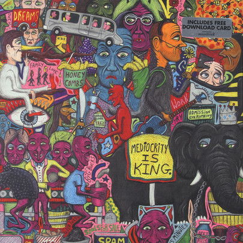

# Too Blessed To Be Stressed

By Paul Thorn

## Album Data

[Discogs URL](https://www.discogs.com/release/6234657-Paul-Thorn-Too-Blessed-To-Be-Stressed)

- Label: Perpetual Obscurity Records
- Formats: Vinyl, LP, Album
- Genres: Rock, Blues
- Rating: 4.67
- Released: 2014-10-14
- Year: 2014
- Release ID: 6234657
- Media condition: 
- Sleeve condition: 
- Speed: 
- Weight: 
- Notes: 

## Album Tracks

| **Position** | **Title** | **Duration** |
|--------------|-----------|--------------|
| A1 | **Everything's Gonna Be Alright** |  |
| A2 | **Too Blessed To Be Stressed** |  |
| A3 | **Everybody Needs Somebody** |  |
| A4 | **I Backslide On Friday** |  |
| A5 | **This Is A Real Goodbye** |  |
| B1 | **Mediocrity Is King** |  |
| B2 | **Don't Let Nobody Rob You Of Your Joy** |  |
| B3 | **Old Stray Dogs & Jesus** |  |
| B4 | **What Kind Of Roof Do You Live Under** |  |
| B5 | **No Place I'd Rather Be** |  |

