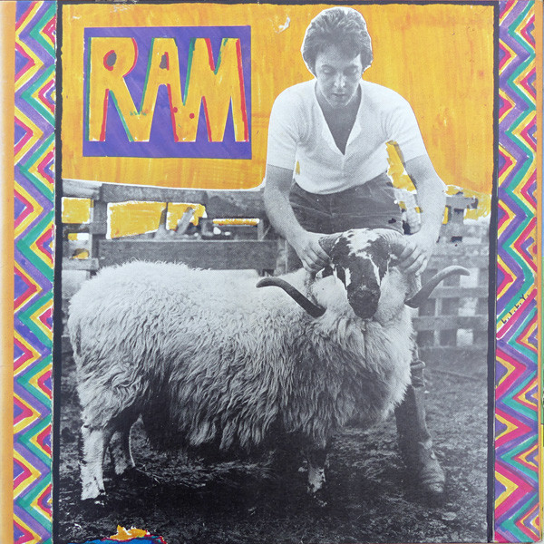

# Ram

By Paul & Linda McCartney

## Album Data

[Discogs URL](https://www.discogs.com/release/1361556-Paul-Linda-McCartney-Ram)

- Label: Apple Records
- Formats: Vinyl, LP, Album, Stereo
- Genres: Rock, Pop Rock, Classic Rock
- Rating: 4.23
- Released: 1971
- Year: 1971
- Release ID: 1361556
- Media condition: 
- Sleeve condition: 
- Speed: 
- Weight: 
- Notes: 

## Album Tracks

| **Position** | **Title** | **Duration** |
|--------------|-----------|--------------|
| A1 | **Too Many People** | 4:09 |
| A2 | **3 Legs** | 2:48 |
| A3 | **Ram On** | 2:30 |
| A4 | **Dear Boy** | 2:14 |
| A5 | **Uncle Albert / Admiral Halsey** | 4:50 |
| A6 | **Smile Away** | 4:01 |
| B1 | **Heart Of The Country** | 2:22 |
| B2 | **Monkberry Moon Delight** | 5:25 |
| B3 | **Eat At Home** | 3:22 |
| B4 | **Long Haired Lady** | 6:05 |
| B5 | **Ram On** | 0:55 |
| B6 | **The Back Seat Of My Car** | 4:29 |

## Artist Roles

| **Name** | **Role** |
|----------|----------|
| **Armin Steiner** | Engineer |
| **Dixon Van Winkle** | Engineer |
| **James William Guercio** | Engineer |
| **Phil Ramone** | Engineer |
| **Ted Brosnan** | Engineer |
| **Tim Geelan** | Engineer |
| **Eirik The Norwegian** | Engineer [Mixing] |
| **Linda McCartney** | Photography By |
| **Paul & Linda McCartney** | Producer |
| **Paul & Linda McCartney** | Written-By |
| **Paul McCartney** | Written-By |

