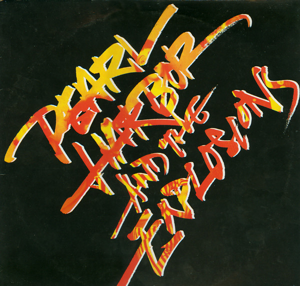

# Pearl Harbor And The Explosions

By Pearl Harbor And The Explosions

## Album Data

[Discogs URL](https://www.discogs.com/release/890551-Pearl-Harbor-And-The-Explosions-Pearl-Harbor-And-The-Explosions)

- Label: Warner Bros. Records
- Formats: Vinyl, LP, Album
- Genres: Rock, New Wave
- Rating: 3.67
- Released: 1980
- Year: 1980
- Release ID: 890551
- Media condition: 
- Sleeve condition: 
- Speed: 
- Weight: 
- Notes: 

## Album Tracks

| **Position** | **Title** | **Duration** |
|--------------|-----------|--------------|
| A1 | **Drivin'** | 4:34 |
| A2 | **You Got It (Release It)** | 2:29 |
| A3 | **Don't Come Back** | 3:30 |
| A4 | **Keep Going** | 3:21 |
| A5 | **Shut Up And Dance** | 4:00 |
| B1 | **The Big One** | 4:06 |
| B2 | **So Much For Love** | 3:01 |
| B3 | **Get A Grip On Yourself** | 3:30 |
| B4 | **Up And Over** | 5:51 |

## Artist Roles

| **Name** | **Role** |
|----------|----------|
| **Hilary Stench** | Bass, Vocals |
| **Basil Pao** | Design [Cover Design] |
| **John Stench** | Drums, Percussion |
| **Jim Gaines** | Engineer |
| **Ken Kessie** | Engineer [Assistant] |
| **Wayne Lewis** | Engineer [Assistant] |
| **Peter Bilt** | Guitar, Vocals |
| **John Golden** | Mastered By |
| **Michael Jang** | Photography By |
| **David Kahne** | Producer |
| **Pearl E. Gates** | Vocals, Percussion |
| **Hilary Stench** | Written-By |
| **John Stench** | Written-By |
| **Pearl E. Gates** | Written-By |
| **Peter Bilt** | Written-By |

