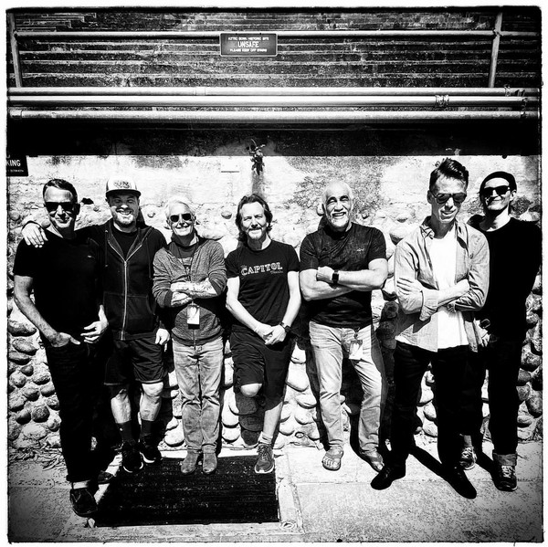

# Pearl Jam

## Artist Profile

Alternative Rock (Modern Rock) band from Seattle, Washington (USA). Inducted to the Rock and Roll Hall of Fame in 2017.

Formed from the ashes of Jeff and Stone's previous band Mother Love Bone and the Temple Of The Dog tribute project (featuring Eddie Vedder on a number of tracks), Pearl Jam were catapulted straight to international superstardom with the release of the album "Ten" and the single 'Alive'. One of the Seattle grunge scene a-list bands, their star faded considerably when that scene fell out of fashion. 

This appears to have suited the band fine as they've continued to record increasingly experimental music with their line-up almost intact (they have had a number of drummers over the years - Dave Krusen, David Abbruzzese, Jack Irons and, now, the drummer who played on their original demos and with Temple of the Dog - Matt Cameron, who also plays drums for Soundgarden. In 1995, they played as the backing band on Neil Young's "Mirror Ball" album and the subsequent tour.

Among the band members' many side projects over the years are Brad (Stone Gossard); Mad Season & The Rockfords (Mike McCready); Three Fish & RNDM (3) (Jeff Ament); The Wellwater Conspiracy (Matt Cameron).

Fan club:
-Ten Club (label entry).
-Ten Club (artist entry).

## Artist Links

- [https://pearljam.com/](https://pearljam.com/)
- [https://www.facebook.com/PearlJam/](https://www.facebook.com/PearlJam/)
- [https://instagram.com/pearljam](https://instagram.com/pearljam)
- [https://pearljam.tumblr.com/](https://pearljam.tumblr.com/)
- [https://twitter.com/pearljam](https://twitter.com/pearljam)
- [https://en.wikipedia.org/wiki/Pearl_Jam](https://en.wikipedia.org/wiki/Pearl_Jam)
- [https://www.youtube.com/pearljam](https://www.youtube.com/pearljam)

## See also

- [Ten](Ten.md)
