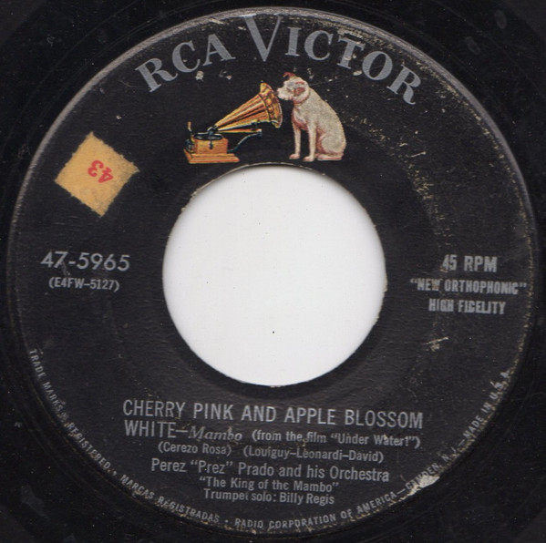

# Cherry Pink And Apple Blossom White / Rhythm Sticks

By Perez Prado And His Orchestra

## Album Data

[Discogs URL](https://www.discogs.com/release/2144064-Perez-Prez-Prado-And-His-Orchestra-Cherry-Pink-And-Apple-Blossom-White-Rhythm-Sticks)

- Label: RCA Victor
- Formats: Vinyl, 7", Single, 45 RPM
- Genres: Jazz, Latin, Stage & Screen, Latin Jazz, Mambo
- Rating: 3.88
- Released: 1954
- Year: 1954
- Release ID: 2144064
- Media condition: 
- Sleeve condition: 
- Speed: 
- Weight: 
- Notes: 

## Album Tracks

| **Position** | **Title** | **Duration** |
|--------------|-----------|--------------|
| A | **Cherry Pink And Apple Blossom White** |  |
| B | **Rhythm Sticks** |  |

