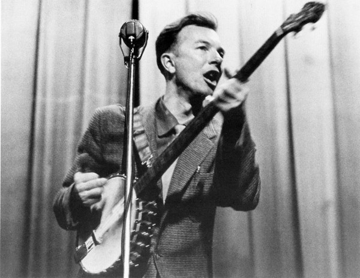

# Pete Seeger

## Artist Profile

American folk singer and songwriter, born May 3rd, 1919 in Manhattan, New York, USA. He passed away at the age of 94 due to natural causes on January 27th, 2014, Manhattan, New York, USA. Stepson of Ruth Crawford Seeger.

Inducted into Songwriters Hall of Fame in 1972.
Inducted into Rock And Roll Hall of Fame in 1996 (Early Influence).

## Artist Links

- [http://www.peteseegermusic.com/](http://www.peteseegermusic.com/)
- [http://en.wikipedia.org/wiki/Pete_Seeger](http://en.wikipedia.org/wiki/Pete_Seeger)
- [https://www.songhall.org/profile/Pete_Seeger](https://www.songhall.org/profile/Pete_Seeger)
- [https://www.imdb.com/name/nm0781517/](https://www.imdb.com/name/nm0781517/)

## See also

- [Song And Play Time](Song_And_Play_Time.md)
