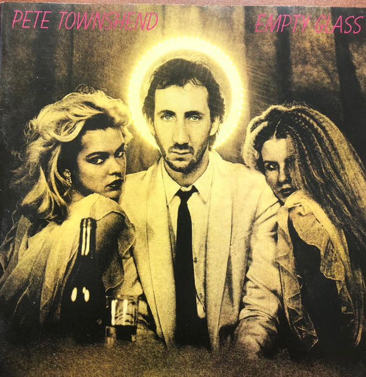

# Empty Glass

By Pete Townshend

## Album Data

[Discogs URL](https://www.discogs.com/release/1104302-Pete-Townshend-Empty-Glass)

- Label: ATCO Records
- Formats: Vinyl, LP, Album
- Genres: Rock, Rock & Roll, Classic Rock
- Rating: 3.74
- Released: 1980
- Year: 1980
- Release ID: 1104302
- Media condition: 
- Sleeve condition: 
- Speed: 
- Weight: 
- Notes: 

## Album Tracks

| **Position** | **Title** | **Duration** |
|--------------|-----------|--------------|
| A1 | **Rough Boys** | 3:59 |
| A2 | **I Am An Animal** | 3:46 |
| A3 | **And I Moved** | 3:22 |
| A4 | **Let My Love Open The Door** | 2:42 |
| A5 | **Jools And Jim** | 2:35 |
| B1 | **Keep On Working** | 3:22 |
| B2 | **Cat's In The Cupboard** | 3:32 |
| B3 | **A Little Is Enough** | 3:32 |
| B4 | **Empty Glass** | 5:20 |
| B5 | **Gonna Get Ya** | 6:22 |

## Artist Roles

| **Name** | **Role** |
|----------|----------|
| **Tony Butler** | Bass |
| **Bob Carlos Clarke** | Design [Sleeve] |
| **James Asher** | Drums |
| **Kenny Jones** | Drums |
| **Mark Brzezicki** | Drums |
| **Simon Phillips** | Drums |
| **Bill Price** | Engineer |
| **Steve Nye** | Engineer [Additional] |
| **Richard Evans (7)** | Graphics |
| **Pete Townshend** | Guitar, Synthesizer, Vocals, Written-By |
| **Peter Hope Evans** | Harmonica |
| **John "Rabbit" Bundrick** | Keyboards |
| **Bill Curbishley** | Management |
| **Chris Chappel** | Management [Assistant] |
| **Ted Jensen** | Mastered By |
| **Tim Young** | Mastered By |
| **Lindsey And Julie** | Other [Models] |
| **Chris Thomas** | Producer |

