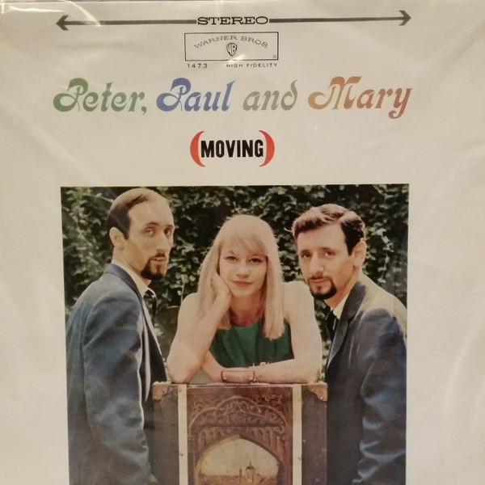

# (Moving)

By Peter, Paul & Mary

## Album Data

[Discogs URL](https://www.discogs.com/release/4672397-Peter-Paul-And-Mary-Moving)

- Label: Warner Bros. Records
Warner Bros. Records
- Formats: Vinyl, LP, Album, Stereo
- Genres: Folk, World, & Country, Folk
- Rating: 3.45
- Released: 1963-03-00
- Year: 1963
- Release ID: 4672397
- Media condition: 
- Sleeve condition: 
- Speed: 
- Weight: 
- Notes: 

## Album Tracks

| **Position** | **Title** | **Duration** |
|--------------|-----------|--------------|
| A1 | **Settle Down (Goin' Down That Highway)** |  |
| A2 | **Gone The Rainbow** |  |
| A3 | **Flora** |  |
| A4 | **Pretty Mary** |  |
| A5 | **Puff** |  |
| A6 | **This Land Is Your Land** |  |
| B1 | **Man Come Into Egypt** |  |
| B2 | **Old Coat** |  |
| B3 | **Tiny Sparrow** |  |
| B4 | **Big Boat** |  |
| B5 | **Morning Train** |  |
| B6 | **A'soalin'** |  |

## Artist Roles

| **Name** | **Role** |
|----------|----------|
| **Bill Schwartau** | Engineer [Recording] |
| **John Court** | Liner Notes |
| **Milton Okun** | Music Director [Musical Director] |
| **Barry Feinstein** | Photography By [Back] |
| **Bernard Cole** | Photography By [Front] |
| **Albert B. Grossman** | Producer |

