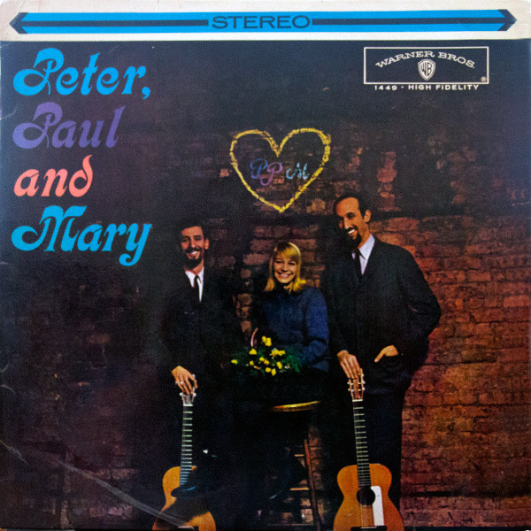

# Peter, Paul And Mary

By Peter, Paul & Mary

## Album Data

[Discogs URL](https://www.discogs.com/release/4143239-Peter-Paul-And-Mary-Peter-Paul-And-Mary)

- Label: Warner Bros. Records
- Formats: Vinyl, LP, Album, Stereo
- Genres: Folk, World, & Country, Folk
- Rating: 3.71
- Released: 1962
- Year: 1962
- Release ID: 4143239
- Media condition: 
- Sleeve condition: 
- Speed: 
- Weight: 
- Notes: 

## Album Tracks

| **Position** | **Title** | **Duration** |
|--------------|-----------|--------------|
| A1 | **Early In The Morning** |  |
| A2 | **500 Miles** |  |
| A3 | **Sorrow** |  |
| A4 | **This Train** |  |
| A5 | **Bamboo** |  |
| A6 | **It's Raining** |  |
| B1 | **If I Had My Way** |  |
| B2 | **Cruel War** |  |
| B3 | **Lemon Tree** |  |
| B4 | **If I Had A Hammer** |  |
| B5 | **Autumn To May** |  |
| B6 | **Where Have All The Flowers Gone** |  |

## Artist Roles

| **Name** | **Role** |
|----------|----------|
| **Milton Glaser** | Cover, Design |
| **Bill Schwartau** | Engineer [Recording] |
| **Milton Okun** | Music Director [Musical Direction] |
| **Bernard Cole** | Photography By [Cover Photo] |
| **Albert B. Grossman** | Producer |

