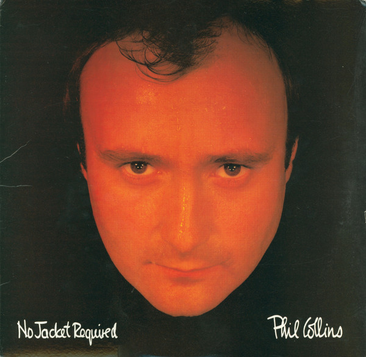

# No Jacket Required

By Phil Collins

## Album Data

[Discogs URL](https://www.discogs.com/release/4246099-Phil-Collins-No-Jacket-Required)

- Label: Atlantic
Atlantic
- Formats: Vinyl, LP, Club Edition, Stereo
- Genres: Electronic, Pop, Synth-pop
- Rating: 3.96
- Released: 1985
- Year: 1985
- Release ID: 4246099
- Media condition: 
- Sleeve condition: 
- Speed: 
- Weight: 
- Notes: 

## Album Tracks

| **Position** | **Title** | **Duration** |
|--------------|-----------|--------------|
| A1 | **Sussudio** | 4:23 |
| A2 | **Only You Know And I Know** | 4:20 |
| A3 | **Long Long Way To Go** | 4:20 |
| A4 | **I Don't Wanna Know** | 4:12 |
| A5 | **One More Night** | 4:47 |
| B1 | **Don't Lose My Number** | 4:46 |
| B2 | **Who Said I Would** | 4:01 |
| B3 | **Doesn't Anybody Stay Together Anymore** | 4:18 |
| B4 | **Inside Out** | 5:14 |
| B5 | **Take Me Home** | 5:51 |

## Artist Roles

| **Name** | **Role** |
|----------|----------|
| **Leland Sklar** | Bass |
| **Baker Dave** | Design [Album Design] |
| **Chief Gary** | Design [Album Design] |
| **Phil Collins** | Design [Album Design] |
| **Phil Collins** | Drums |
| **Daryl Stuermer** | Guitar |
| **Phil Collins** | Keyboards |
| **Peter Ashworth** | Photography By |
| **Phil Collins** | Producer |
| **Hugh Padgham** | Producer, Engineer |
| **Steve "Barney" Chase** | Technician [Assisted By] |
| **Phil Collins** | Vocals |

