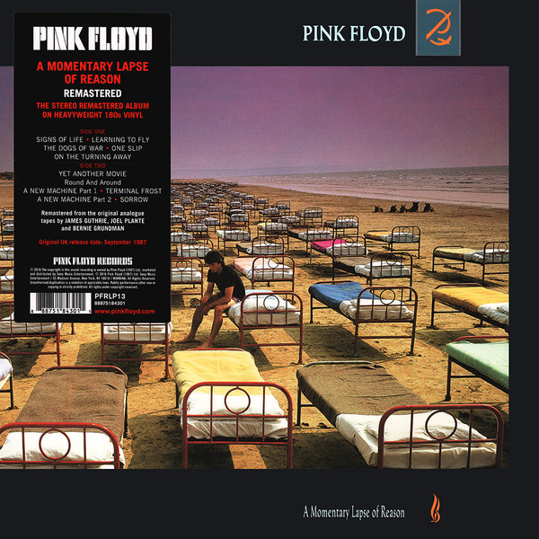

# A Momentary Lapse Of Reason

By Pink Floyd

## Album Data

[Discogs URL](https://www.discogs.com/release/9686509-Pink-Floyd-A-Momentary-Lapse-Of-Reason)

- Label: Pink Floyd Records
Pink Floyd Records
- Formats: Vinyl, LP, Album, Reissue, Remastered
- Genres: Rock, Prog Rock, Alternative Rock
- Rating: 4.44
- Released: 2017-01-20
- Year: 1987
- Release ID: 9686509
- Media condition: 
- Sleeve condition: 
- Speed: 
- Weight: 
- Notes: 

## Album Tracks

| **Position** | **Title** | **Duration** |
|--------------|-----------|--------------|
| A1 | **Signs Of Life** | 4:21 |
| A2 | **Learning To Fly** | 4:49 |
| A3 | **The Dogs Of War** | 6:06 |
| A4 | **One Slip** | 5:01 |
| A5 | **On The Turning Away** | 5:39 |
| B1a | **Yet Another Movie** | 6:14 |
| B1b | **Round And Around** | 1:06 |
| B2 | **A New Machine (Part 1)** | 1:51 |
| B3 | **Terminal Frost** | 6:03 |
| B4 | **A New Machine (Part 2)** | 0:50 |
| B5 | **Sorrow** | 8:37 |

## Artist Roles

| **Name** | **Role** |
|----------|----------|
| **Tom Scott** | Alto Saxophone, Soprano Saxophone |
| **Storm Thorgerson** | Art Direction |
| **Carmen Twillie** | Backing Vocals |
| **Darlene Koldenhoven** | Backing Vocals |
| **Donny Gerrard** | Backing Vocals |
| **Phyllis St. James** | Backing Vocals |
| **Tony Levin** | Bass Guitar, Chapman Stick [Stick] |
| **Nexus (38)** | Design Concept [Front Cover] |
| **Storm Thorgerson** | Design Concept [Front Cover] |
| **Carmine Appice** | Drums |
| **Jim Keltner** | Drums |
| **Nick Mason** | Drums [Electric & Acoustic], Effects [Sound Effects] |
| **Jeff Demorris** | Engineer [Recording And Mixing Assistant] |
| **Marc Desisto** | Engineer [Recording And Mixing Assistant] |
| **Robert Hrycyna** | Engineer [Recording And Mixing Assistant] |
| **Stan Katayama** | Engineer [Recording And Mixing Assistant] |
| **Andy Jackson** | Engineer [Recording And Mixing] |
| **Andrew Ellis** | Graphic Design |
| **Icon (21)** | Graphic Design |
| **Michael Landau** | Guitar |
| **David Gilmour** | Guitar, Vocals, Keyboards, Sequencer [Sequencers] |
| **Jon Carin** | Keyboards |
| **Bob Ezrin** | Keyboards, Percussion, Sequencer [Sequencers] |
| **Bernie Grundman** | Lacquer Cut By |
| **EMKA Productions** | Management |
| **Steve O'Rourke (2)** | Management |
| **Bernie Grundman** | Mastered By |
| **James Guthrie** | Mastered By |
| **Joel Plante** | Mastered By |
| **Bill Payne** | Organ [Hammond] |
| **Steve Forman** | Percussion |
| **Robert Dowling** | Photography By |
| **Richard Wright** | Piano, Vocals, Keyboards [Kurzweil], Organ [Hammond] |
| **Bob Ezrin** | Producer |
| **David Gilmour** | Producer |
| **Guy Charbonneau** | Recorded By [Spherical Sound] |
| **James Guthrie** | Remix [Additional Re-mixing] |
| **John Helliwell** | Saxophone |
| **Ken Caillat** | Sounds [Spherical Sound] |
| **Sarah Bruce** | Sounds [Spherical Sound] |
| **Tom Jones (4)** | Sounds [Spherical Sound] |
| **Patrick Leonard** | Synthesizer |
| **Phil Taylor (5)** | Technician [General Technical & Musical Instrument Supervision] |
| **Scott Page** | Tenor Saxophone |

