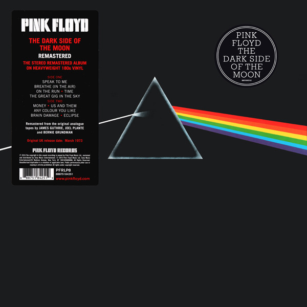

# The Dark Side Of The Moon

By Pink Floyd

## Album Data

[Discogs URL](https://www.discogs.com/release/9296607-Pink-Floyd-The-Dark-Side-Of-The-Moon)

- Label: Pink Floyd Records
Pink Floyd Records
- Formats: Vinyl, LP, Album, Reissue, Remastered
- Genres: Rock, Prog Rock, Pop Rock
- Rating: 4.83
- Released: 2016-11-04
- Year: 1973
- Release ID: 9296607
- Media condition: 
- Sleeve condition: 
- Speed: 
- Weight: 
- Notes: 

## Album Tracks

| **Position** | **Title** | **Duration** |
|--------------|-----------|--------------|
| A1a | **Speak To Me** | 1:30 |
| A1b | **Breathe (In The Air)** | 2:43 |
| A2 | **On The Run** | 3:30 |
| A3 | **Time** | 6:53 |
| A4 | **The Great Gig In The Sky** | 4:15 |
| B1 | **Money** | 6:30 |
| B2 | **Us And Them** | 7:51 |
| B3 | **Any Colour You Like** | 3:24 |
| B4 | **Brain Damage** | 3:50 |
| B5 | **Eclipse** | 1:45 |

## Artist Roles

| **Name** | **Role** |
|----------|----------|
| **George Hardie** | Artwork [Sleeve Art], Artwork [Stickers Art] |
| **Barry St. John** | Backing Vocals |
| **Doris Troy** | Backing Vocals |
| **Lesley Duncan** | Backing Vocals |
| **Liza Strike** | Backing Vocals |
| **Roger Waters** | Bass Guitar, Vocals, Synthesizer [VCS3], Tape [Effects], Lyrics By [All] |
| **Hipgnosis (2)** | Design [Sleeve], Photography By |
| **Alan Parsons** | Engineer |
| **Peter James** | Engineer [Assistant] |
| **Richard Wright** | Keyboards, Vocals, Synthesizer [VCS3] |
| **Nick Mason** | Percussion, Tape [Effects] |
| **Pink Floyd** | Producer, Music By |
| **Bernie Grundman** | Remastered By |
| **James Guthrie** | Remastered By |
| **Joel Plante** | Remastered By |
| **Dick Parry** | Saxophone |
| **Chris Thomas** | Supervised By [Mixing] |
| **Clare Torry** | Vocals, Composed By [Vocal] |
| **David Gilmour** | Vocals, Guitar, Synthesizer [VCS3] |
| **David Gilmour** | Written-By |
| **Nick Mason** | Written-By |
| **Richard Wright** | Written-By |
| **Roger Waters** | Written-By |

