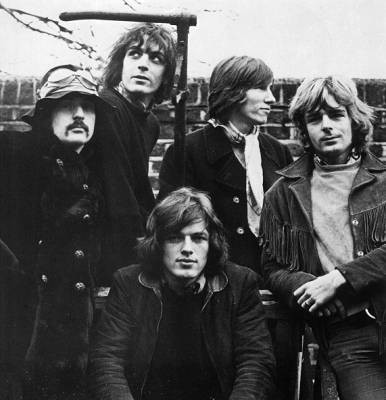

# Pink Floyd

## Artist Profile

Pink Floyd was an English rock band from London. Founded in 1965, the group achieved worldwide acclaim, initially with innovative psychedelic music, and later in a genre that came to be termed progressive rock.

Distinguished by philosophical lyrics, musical experimentation, frequent use of sound effects and elaborate live shows, Pink Floyd remains one of the most commercially successful and influential groups in the history of popular music.

David Gilmour – guitar, slide guitar, vocals (1968-2014)
Richard Wright – keyboards, vocals (1965-1980, 1987-2008)
Nick Mason – drums, percussion, sound effects (1965-2014)
Roger Waters – bass guitar, vocals, sound effects (1965-1985)
Syd Barrett – guitar, vocals (1965-1968)

Other players:
Rado Klose – guitar (1965)
Jon Carin – backing vocals, keyboards, slide guitar, sound effects (1985-1995)
Guy Pratt – bass guitar, backing vocals (1987-1995)

Inducted into Rock And Roll Hall of Fame in 1996 (Performer).
Group name was taken from both Pink Anderson and Floyd &quot;Dipper Boy&quot; Council as a tribute to the American blues music they loved.

## Artist Links

- [https://www.pinkfloyd.com](https://www.pinkfloyd.com)
- [http://pinkfloydarchives.com/DiscTOC.htm](http://pinkfloydarchives.com/DiscTOC.htm)
- [https://www.45cat.com/45_search.php?sq=pink+floyd](https://www.45cat.com/45_search.php?sq=pink+floyd)
- [https://www.britannica.com/topic/Pink-Floyd](https://www.britannica.com/topic/Pink-Floyd)
- [https://www.facebook.com/pinkfloyd/](https://www.facebook.com/pinkfloyd/)
- [https://www.facebook.com/PinkFloydCollectorsClub](https://www.facebook.com/PinkFloydCollectorsClub)
- [https://genius.com/artists/Pink-floyd](https://genius.com/artists/Pink-floyd)
- [https://www.imdb.com/name/nm0969139/](https://www.imdb.com/name/nm0969139/)
- [https://www.instagram.com/PinkFloyd/](https://www.instagram.com/PinkFloyd/)
- [https://pinkfloydscrapbooks.myfreesites.net/](https://pinkfloydscrapbooks.myfreesites.net/)
- [http://www.progarchives.com/artist.asp?id=364](http://www.progarchives.com/artist.asp?id=364)
- [https://twitter.com/PinkFloyd](https://twitter.com/PinkFloyd)
- [https://whypinkfloyd.tumblr.com/](https://whypinkfloyd.tumblr.com/)
- [https://en.wikipedia.org/wiki/Pink_Floyd](https://en.wikipedia.org/wiki/Pink_Floyd)
- [https://www.youtube.com/channel/UCY2qt3dw2TQJxvBrDiYGHdQ](https://www.youtube.com/channel/UCY2qt3dw2TQJxvBrDiYGHdQ)

## See also

- [A Momentary Lapse Of Reason](A_Momentary_Lapse_Of_Reason.md)
- [Animals](Animals.md)
- [Interstellar Overdrive](Interstellar_Overdrive.md)
- [Meddle](Meddle.md)
- [The Dark Side Of The Moon](The_Dark_Side_Of_The_Moon.md)
- [Wish You Were Here](Wish_You_Were_Here.md)
