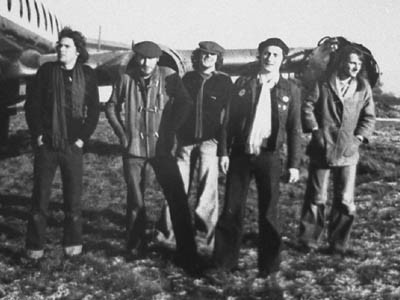

# Plummet Airlines

## Artist Profile

Five-piece band from Nottingham, 1974-1977, who had one of the earliest singles on Stiff Records "Silver Shirt" and a second single on State Records "It's Hard". Main singer / songwriter Harry Stephenson , Darryl Hunt / bass and vocals (later with The Favourites (2) and The Pogues, Duncan Kerr / guitar and backing vocals (in The Favourites (2), Darts, Brainiac 5) Keith Gotheridge / drums (also in The Favourites (2) and Darts) and Richard "WIldman" Booth (Brainiac 5). Played Around London and the UK, broke up when Punk changed everything.

## Artist Links

- [http://homepage.ntlworld.com/p.greaves/990001.htm](http://homepage.ntlworld.com/p.greaves/990001.htm)
- [https://en.wikipedia.org/wiki/Plummet_Airlines](https://en.wikipedia.org/wiki/Plummet_Airlines)

## See also

- [Silver Shirt](Silver_Shirt.md)
