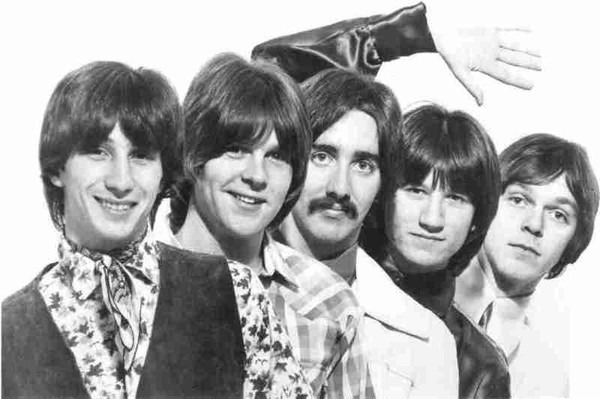

# Poco

## Artist Profile

American country rock band originally formed in 1968 and born from the wreckage of Buffalo Springfield.
They can rightly claim the distinction of being among the first bands to cross over from rock to country.
The band begins its live career at The Troubadour using a couple of different names. Billed as Pogo, the band made their debut at a Monday hoot night. Mondays in 1968 October were 7th, 14th, and 21st. They played a five song set. It immediately gets rave notices for their tight, energetic and upbeat sets. They managed to bank effectively on their positive energy and what appeared at the time to be a logical extension of Furay and Messina's work on the final Buffalo Springfield album Last Time Around.
Consisting of pedal steel player Rusty Young, singer and guitarist Richie Furay, singer and guitarist Jim Messina, guitarist Randy Meisner and drummer George Grantham. Randy Meisner's tenure with Poco ends during the recording of their first album. He participates in the early shows of 1969, but is gone by April. Over the years, Poco’s members — including veteran singer-guitarist Paul Cotton — came and went. That left Young as Poco’s sole constant. Young was at every single gig Poco has played since its inception. And he was there with singer Jack Sundrud, drummer George Lawrence and keyboardist Michael Webb when Poco recorded its latest studio album, 2013’s All Fired Up.

## Artist Links

- [https://www.pocoband.com/](https://www.pocoband.com/)
- [http://www.poconut.org](http://www.poconut.org)
- [http://en.wikipedia.org/wiki/Poco](http://en.wikipedia.org/wiki/Poco)
- [https://www.imdb.com/name/nm1339742/](https://www.imdb.com/name/nm1339742/)

## See also

- [Crazy Eyes](Crazy_Eyes.md)
