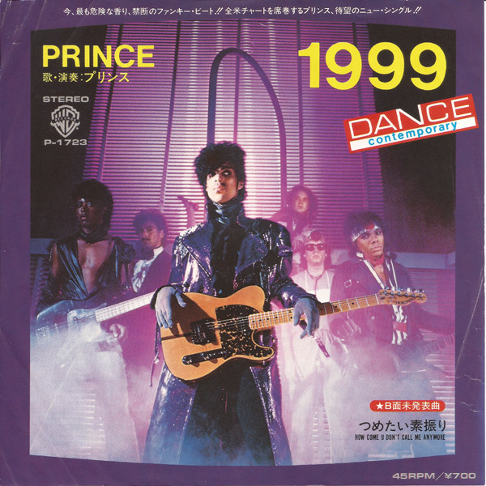

# 1999

By Prince

## Album Data

[Discogs URL](https://www.discogs.com/release/3139530-Prince-1999)

- Label: Rhino Records (2)
Warner Bros. Records
- Formats: Vinyl, LP, Album, Reissue, Remastered
- Genres: Funk / Soul
- Rating: 4.65
- Released: 2011-05-10
- Year: 1982
- Release ID: 3139530
- Media condition: 
- Sleeve condition: 
- Speed: 
- Weight: 
- Notes: 

## Album Tracks

| **Position** | **Title** | **Duration** |
|--------------|-----------|--------------|
| A1 | **1999** |  |
| A2 | **Little Red Corvette** |  |
| A3 | **Delirious** |  |
| B1 | **Let's Pretend We're Married** |  |
| B2 | **D.M.S.R.** |  |
| C1 | **Automatic** |  |
| C2 | **Something In The Water (Does Not Compute)** |  |
| C3 | **Free** |  |
| D1 | **Lady Cab Driver** |  |
| D2 | **All The Critics Love U In New York** |  |
| D3 | **International Lover** |  |

## Artist Roles

| **Name** | **Role** |
|----------|----------|
| **Don Batts** | Engineer [2nd] |
| **Cavallo, Ruffalo & Fargnoli** | Management |
| **Bernie Grundman** | Mastered By, Remastered By, Lacquer Cut By |
| **Prince** | Producer, Arranged By, Composed By, Performer |
| **Peggy McCreary** | Recorded By, Mixed By |

