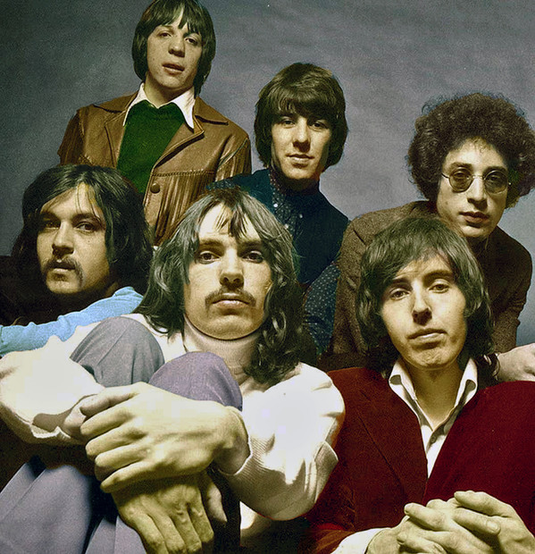

# Procol Harum

## Artist Profile

After the rhythm & blues band The Paramounts disbanded in 1966, singer Gary Brooker helped form Procol Harum early in 1967.

In July 1967 the band got their first #1 hit "A Whiter Shade of Pale", co-written by Brooker & Reid, becoming one of the first real "symphonic rock" songs. A lot of albums and singles were released afterwards, but never enjoyed the success of their first single.

The line up for their first single was:

Gary Brooker: vocals and piano
Matthew Fisher: Hammond organ
David Knights: bass
Ray Royer: guitar
Drums by session drummer Bill Eyden.

Procol Harum re-formed in October 1991 and recorded "The Prodigal Stranger" with this line-up:
 
Brooker - vocals and piano
Keith Reid - words
Fisher - hammond organ
with guests:
Dave Bronze - bass
Mark Brzezicki - drums
Jerry Stevenson - mandolin and guitar

## Artist Links

- [https://procolharum.com/](https://procolharum.com/)
- [https://www.onamrecords.com/artists/procol-harum](https://www.onamrecords.com/artists/procol-harum)
- [https://en.wikipedia.org/wiki/Procol_Harum](https://en.wikipedia.org/wiki/Procol_Harum)
- [https://www.whosampled.com/Procol-Harum/](https://www.whosampled.com/Procol-Harum/)
- [https://www.imdb.com/name/nm1718978/](https://www.imdb.com/name/nm1718978/)

## See also

- [Live In Concert With The Edmonton Symphony Orchestra](Live_In_Concert_With_The_Edmonton_Symphony_Orchestra.md)
